## Neural Networks Model

### Neural Networks Intuition

- The original motivation was to write software that could mimic how the human brain learns and thinks
- First application area that modern neural networks or deep learning had a huge impact was speech recognition, then computer vision, text (NLP), and so on
- Often want to simulate many such neurons at the same time
    - In this example 3 neuron, these neurons do collectively is input a few numbers
    - Carry out some computation
    - Then, output some other numbers

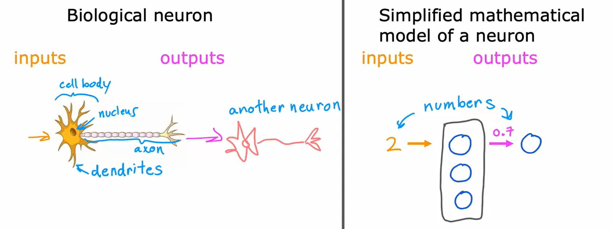

- To illustrate how neural networks work, we'll use an example from demand prediction.
    - Look at the product and try to predict, will this product be a top seller or not? 
- The first example use 1 feature (x) = price as an input
    - Apply logistic regression to fit a sigmoid function to the data
    - The output `f(x)` or `a` of your prediction might look like this

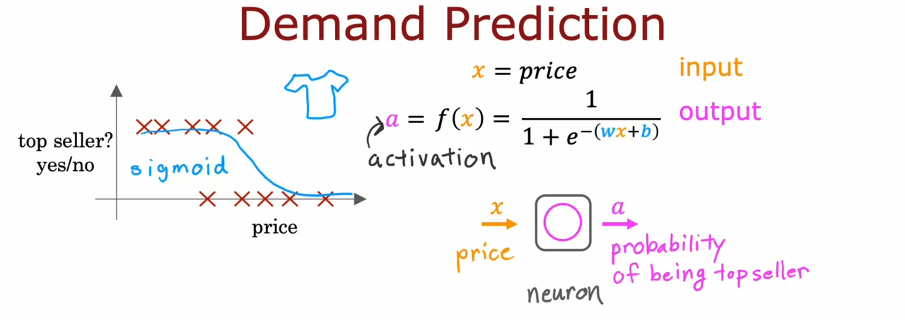

- Let's now look at a more complex example with four features: price, shipping cost, marketing, material
    - Form into 3 neuron: affordability, awareness, and perceived quality (called a layer)
    - Affordability, awareness, and perceive quality are called activations
    - Then wire the outputs of these three neurons to another neuron (another logistic regression unit)
    - That finally inputs those three numbers and outputs the probability of this t-shirt being a top seller

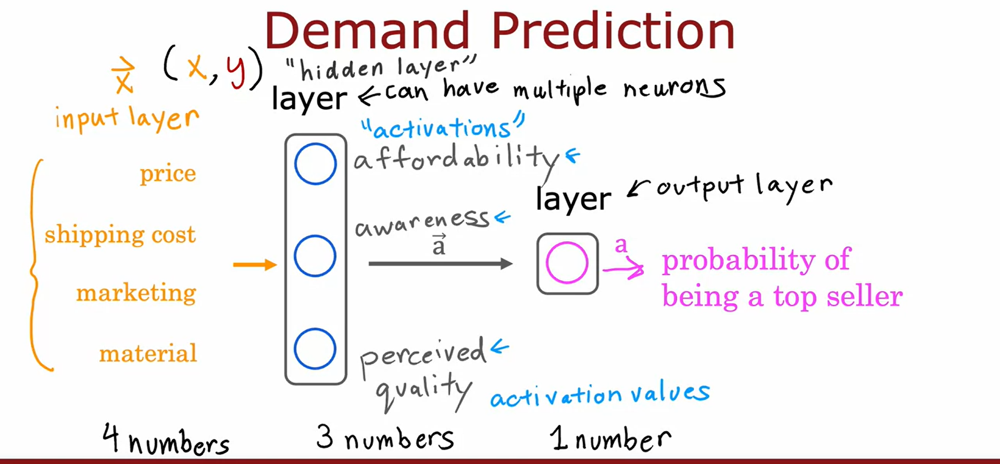

- The `input layer` receives the input data, and the `output layer` produces the final prediction.
- The term `activations` comes from biological neurons, and it refers to the degree that the biological neuron is sending a high output value or sending many electrical impulses to other neurons to the downstream from it
- `Hidden layer` is a layer in between the input layer and the output layer, it is called a "hidden" layer because the values or activations of the neurons in this layer are not directly observed or known in the training data
- The hidden layer performs computations on the input data and learns to extract relevant features or patterns from the input. These learned features are then used to make predictions or classifications in the output layer
- `Neural network architecture` is the choice of number of hidden layers and the number of neurons in each hidden layer are design that can impact the performance and complexity of the neural network.

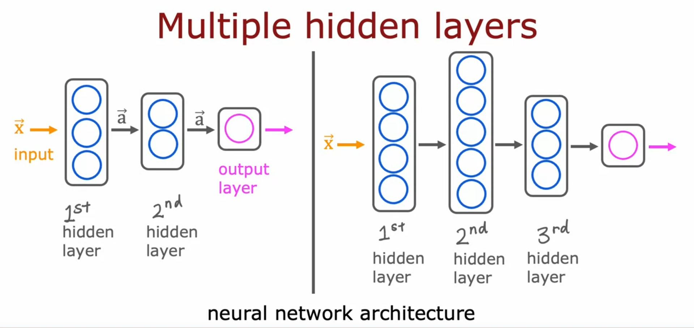

- Another example is in face recognation
    - The input is a picture and outputs the identity of the person in the picture
    - Where the image is 1,000 by 1,000 pixels or grid
    - Intensity values or pixel brightness values, goes from 0-255

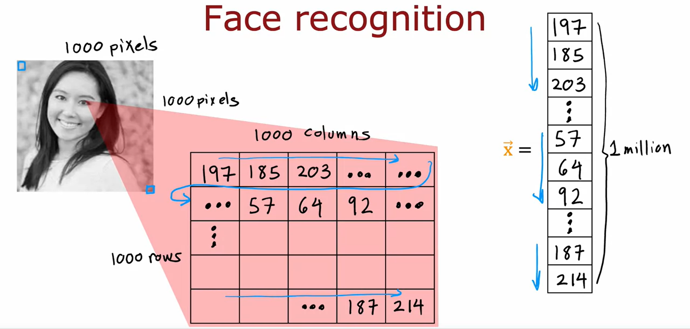

- The neural networks can learn these feature detectors on their own, without explicit instructions
    - able to figure out these things all by itself from data
- First hidden layer are shown looking at relatively small windows to look for these edges
- In the second hidden layer is looking at bigger window
- The third hidden layer is looking at even bigger window

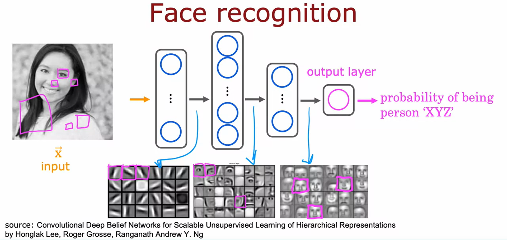

### Neural Networks Layers

- Learns how to construct a layer of neurons and how to put them together to form a large neural network
- An example of a neural network with an input layer, a hidden layer, and an output layer
    - The hidden layer consists of three neurons, each implementing a logistic regression unit
    - Each neuron in the hidden layer takes inputs from the input layer and computes an activation value using its parameters (weights and biases)
    - The activation value is obtained by applying the logistic function to the weighted sum of inputs plus the bias term
    - The notation used for neural networks includes `superscripts` and subscripts to denote the layer and unit, ex [1], [2], etc
    - The output of the hidden layer becomes the input for the output layer, which consists of a single neuron
    - The output neuron in the output layer computes its activation value using the sigmoid function applied to the weighted sum of inputs plus the bias term
    - Thresholding the output for binary predictions by comparing it to a threshold value (e.g., 0.5).
    - If the output is above the threshold, the prediction is considered as 1; otherwise, it is considered as 0

- Layer 0: Input layer
- Layer 1: Hidden layer
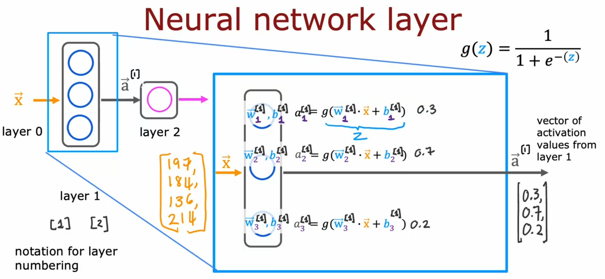

- Layer 2: Output layer
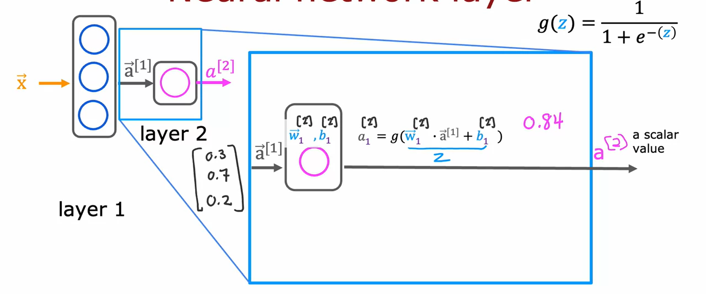
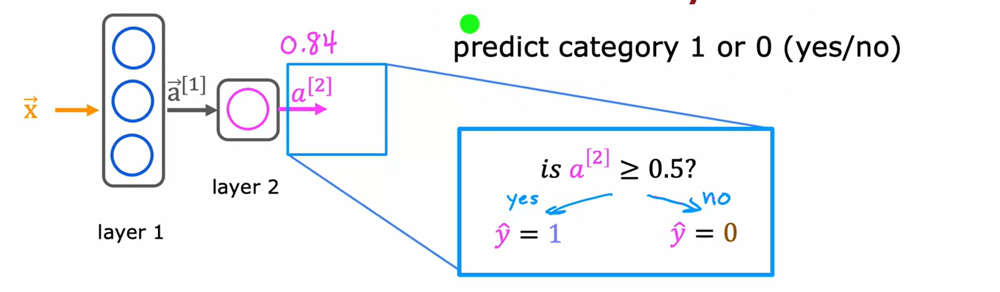

### More Complex Neural Networks

- Focuses on Layer 3, the third hidden layer, and explains how it takes inputs and computes the activation values using parameters and activations from the previous layer
- The general equation for computing the activation values of layer l, unit j
    - involves the activation function, weights, activations value from the previous layer, and biases
- The activation function is also known as the sigmoid function and outputs the activation values

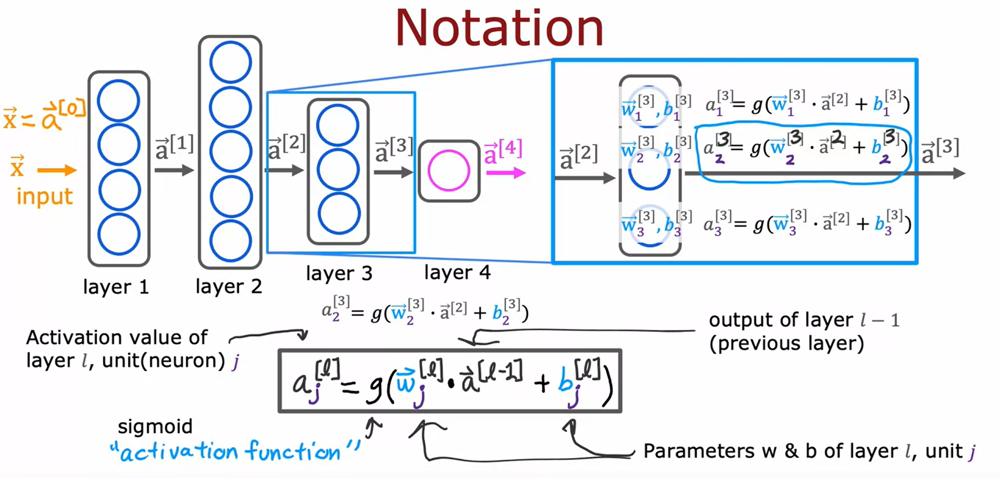

### Inference: making predictions (forward propagation)

- `Forward propagation` is an algorithm used in neural networks for making predictions or inferences
- Forward propagation is called so because it propagates the activations of the neurons in a forward direction, from left to right.
- Example is handwritten digit recognition, distinguishing between the digits zero and one
- The input is an 8x8 image with pixel intensity values ranging from 0 to 255
    - 0 is black pixel, 255 is white pixel
- The neural network used in the example has 2 hidden layers and 1 output layer
    - 25 neurons in the first hidden layer
    - 15 neurons in the second hidden layer
    - The output layer predicts the probability of the input image being a 1 or 0

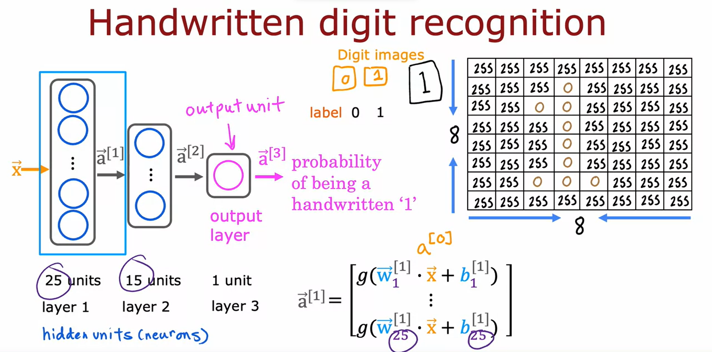
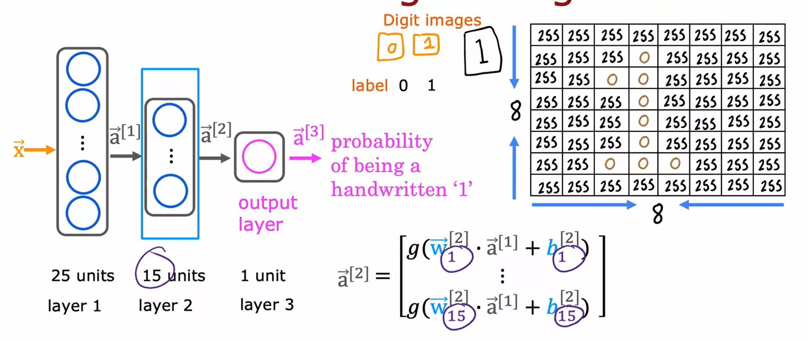
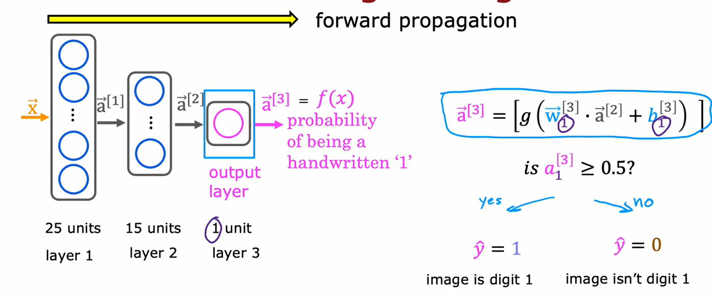

## Tenserflow Implementataion

- The simple steps for forward propagation in TensorFlow
    - including computing the values of each layer
    - then optionally thresholding the output

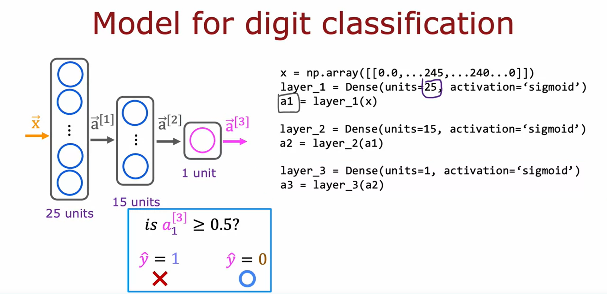

### Data in Tenserflow

- TensorFlow uses matrices to represent data for computational efficiency
- There is a difference between numpy array
    - single square brackets ([numbers]) represent a 1D vector
    - double square brackets ([[numbers]]) represent a 2D array

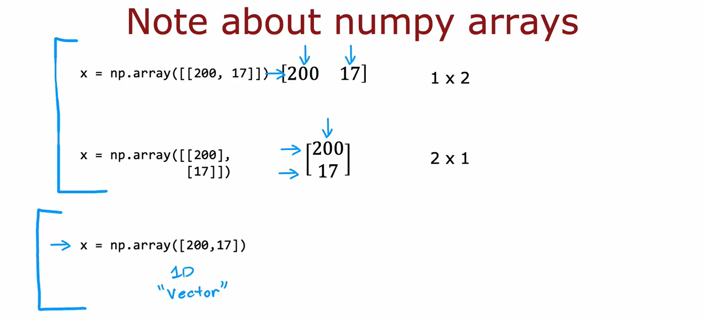
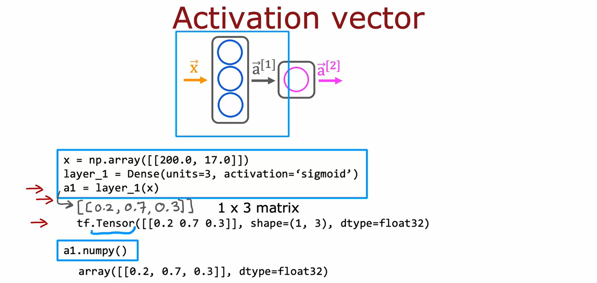

### Building a Neural Network

- Sequential function allows you to string together layers to form a neural network
- To train the neural network using the `model.compile` and `model.fit` functions in TensorFlow
- To perform inference on the neural network using the `model.predict` function

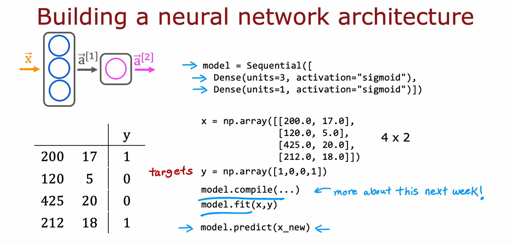
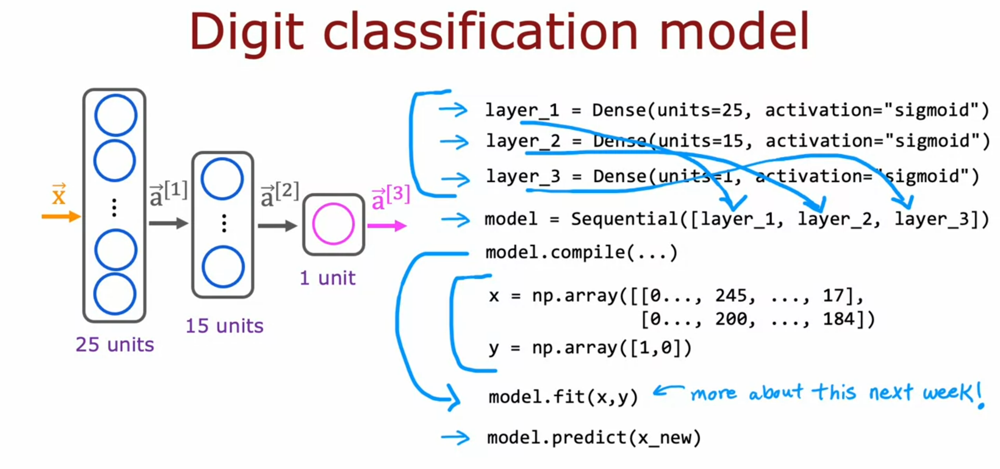

### Implementation in Python

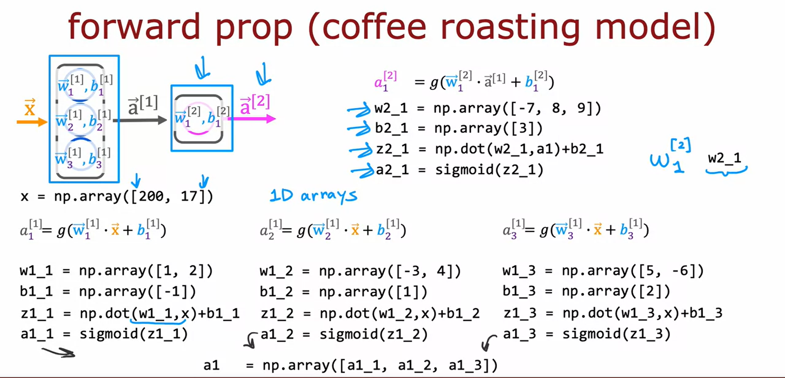
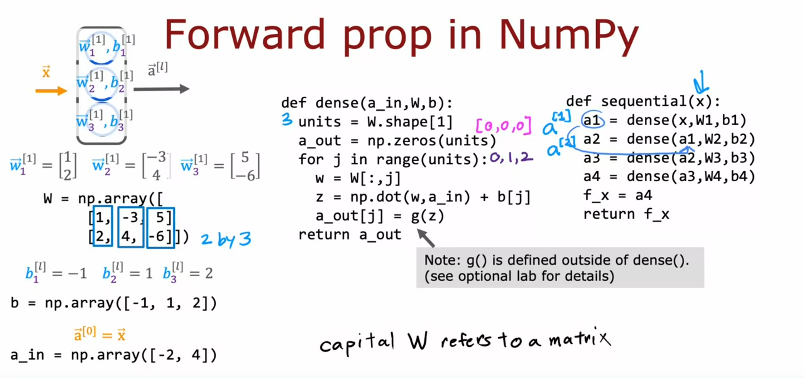

### Artificial General Intelligence (AGI)

- In AI, tehre are 2 types
    - Artificial general intelligence (AGI)
        - AGI refers to AI systems that can perform any task a human can do
    - Artificial narrow intelligence (ANI)
        - ANI refers to AI systems that are designed to perform specific tasks
- There are experiments conducted on animals that suggest that different parts of the brain can adapt to process different types of sensory inputs
- This leads to the hypothesis that a small number of learning algorithms may be responsible for a wide range of intelligent behaviors
- The specific algorithms are not yet known, but remains hopeful that they can be discovered in the future
- The power and usefulness of neural networks and machine learning is remain, even without achieving AGI