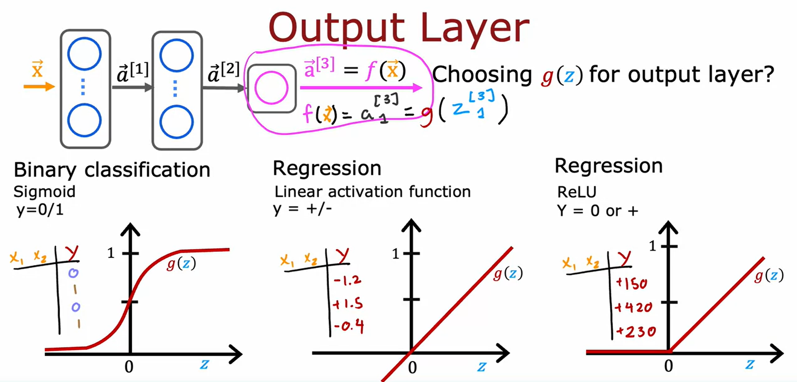

## Neural Networks Training

Given set of (X,Y) examples. How to build and train this in code?

```python
import tensorflow as tf
from tensorflow.keras import Sequential
from tensorflow.keras.layers import Dense
from tensorflow.keras.losses import BinaryCrossentropy

# Step 1: Specify the model architecture
model = Sequential([
    Dense(25, activation='sigmoid'),  # 1st hidden layer with 25 units
    Dense(15, activation='sigmoid'),  # 2nd hidden layer with 15 units
    Dense(1, activation='sigmoid')    # output layer with 1 unit
])

# Step 2: Compile the model
model.compile(loss=BinaryCrossentropy())

# Step 3: Train the model
model.fit(X, Y, epochs=10)  # X is the input dataset, Y is the ground truth labels
                            # Epochs is steps of the learning algorithm (gradient descent)
```
<br>

Recall how you had trained a logistic regression model in the previous course


Let's look in greater detail in these three steps in the context of training a neural network
- Step 1: Specify how to compute the output given the input x and parameters w and b
    - This is done by specifying the architecture of the neural network


- Step 2: Specify the loss function, which defines the cost function used to train the neural network
    - For binary classification problems, the binary cross-entropy loss function is commonly used
    - Measures the difference between the predicted probabilities and the true labels of the binary classification problem
    - It is used to train the model by minimizing the average loss over the entire training set using optimization algorithms like gradient descent


- Step 3: Minimize the cost function using an optimization algorithm like gradient descent
    - TensorFlow implements backpropagation to compute the partial derivatives needed for gradient descent


## Activation Functions

There are different activation functions in neural networks
- Sigmoid Activation Function
    - Defined as g(z) = 1 / (1 + e^(-z))
    - It maps the input values to a range between 0 and 1
    - It is commonly used in the past for binary classification problems
    - It is smooth and differentiable, which allows for gradient-based optimization algorithms to be used during training
    - However, it suffers from the vanishing gradient problem, where the gradients become very small for extreme input values, leading to slower convergence and difficulty in training deep neural networks

- ReLU (Rectified Linear Unit) Activation Function:
    - Defined as g(z) = max(0, z)
    - It maps the input values to 0 for negative values and keeps the positive values unchanged
    - It is computationally efficient and allows for faster training of deep neural networks
    - It does not suffer from the vanishing gradient problem and helps in avoiding the saturation of neurons
    - However, it can cause dead neurons (neurons that output 0) if the input value is negative, which means those neurons will not contribute to the learning process


**How to choose the right activation function?**

- For the output layer
    - If you have a binary classification problem (y is either 0 or 1), use the sigmoid activation function
    - If you have a regression problem (y can be positive or negative), use the linear activation function
    - If you have a regression problem but y can only take on non-negative values (e.g., predicting house prices), use the ReLU activation function



- For the hidden layers
    - The ReLU activation function is the most common choice and is recommended by many practitioners
    - The ReLU function is faster to compute and helps avoid slow learning with gradient descent
    - The Sigmoid activation function in the output layer if you have a binary classification problem
    - There are also other activation functions like tanh, LeakyReLU, etc (not covered in this video)


**Why do we need activation function?**

- Using a linear activation function in every neuron would make the neural network equivalent to linear regression
    - A simpler example is given with one input, one hidden unit, and one output unit
    - If a linear activation function is used for all layers, the neural network becomes a linear function
    - Multiple layers in a neural network don't allow it to compute more complex features than a linear function
- Using a linear activation function in the hidden layers defeats the purpose of using a neural network
- The ReLU activation function is recommended for the hidden layers
- Using logistic activation function for the output layer makes the model equivalent to logistic regression
- Neural networks are needed for more complex classification problems with multiple categorical values.

### Multiclass Classification

- Multiclass classification refers to classification problems where there can be more than just two possible output labels
- In multiclass classification, you have more than two possible values for the output variable


The softmax regression algorithm is a generalization of logistic regression for multiclass classification.
Softmax regression estimates the probability of each class being the output.
The algorithm can learn a decision boundary that divides the input space into multiple categories.
Softmax regression can be used in neural networks to perform multiclass classification.

### Softmax

- Softmax regression as a generalization of logistic regression for multiclass classification
- Logistic regression applies when y can take on two possible output values (0 or 1)
- Softmax regression extends logistic regression to handle multiple output classes
- Softmax regression computes separate values (z) for each output class
- The algorithm then calculates the probability (a) for each class using the softmax function


- The parameters (w and b) of softmax regression determine the estimates for each class
- The cost function for softmax regression is defined as the negative log of the estimated probability for the correct class
- The goal is to minimize the cost function by adjusting the parameters
- Softmax regression can be used to build multiclass classification algorithms


### Neural Network with Softmax output

How to build a Neural Network for multi-class classification using the Softmax regression model?
- The Neural Network architecture is modified to have 10 output units for classifying digits from zero to nine
- The output layer of the Neural Network is a Softmax layer
    - which provides estimates of the chance of each possible output label
- The forward propagation process in the Neural Network involves computing the activations for the output layer using the Softmax function
- The Softmax activation function is unique because each activation value depends on all the values of Z.


The example of how to implement this Neural Network using TensorFlow

```python
import tensorflow as tf
from tensorflow.keras import Sequential
from tensorflow.keras.layers import Dense
from tensorflow.keras.losses import SparseCategoricalCrossentropy

# Step 1: Specify the model architecture
model = Sequential([
    Dense(25, activation='relu'),    # 1st hidden layer with 25 units
    Dense(15, activation='relu'),    # 2nd hidden layer with 15 units
    Dense(10, activation='softmax')  # output layer with 10 unit
])

# Step 2: Specify loss and cost functions
model.compile(loss=SparseCategoricalCrossentropy())

# Step 3: Train the model
model.fit(X, Y, epochs=100)  # X is the input dataset, Y is the ground truth labels
```

- The code sequentially strings together three layers
    - the first layer with 25 units and ReLU activation
    - the second layer with 15 units and ReLU activation
    - the third layer with 10 output units and Softmax activation
- The cost function used for training the model is called SparseCategoricalCrossentropy, which is suitable for multi-class classification problems
- There is a better version of the code for implementing this Neural Network (in next)

### Improved implementation of softmax

How TensorFlow can rearrange terms to reduce these errors and improve the accuracy of computations?
- Uses logistic regression as an example to illustrate the concept of rearranging terms in the loss function
- Applies the same idea to softmax regression


### Advanced Optimization

- The **Adam (Adaptive Moment Estimation) algorithm** is an optimization algorithm that can train neural networks faster than gradient descent
- Adam adjusts the learning rate automatically based on the behavior of the parameters
    - If a parameter keeps moving in the same direction, Adam increases the learning rate for that parameter
    - If a parameter oscillates back and forth, Adam reduces the learning rate for that parameter
- The Adam algorithm uses different learning rates for each parameter of the model
- To implement Adam in TensorFlow, you specify the optimizer as `tf.keras.optimizers.Adam`


### Additional Layer Types

- In a convolutional layer, each neuron only looks at a part of previous layer's output
- Using convolutional layers can speed up computation and reduce the need for large amounts of training data (less prone to overfitting)
- Convolutional layers are often used in convolutional neural networks (CNNs)
- CNNs can have multiple convolutional layers, each with different window sizes and numbers of neurons
- By choosing the architectural parameters effectively, CNNs can be more effective than dense layers for certain applications
- Below is the example with the first hidden layer being a convolutional layer, the second hidden layer also being a convolutional layer and then the output layer being a sigmoid layer 

