## Advice for applying machine learning

### Deciding what to try next

- The example of implementing regularized linear regression to predict housing prices and discusses what to try next if the model makes large errors in its predictions
- There different things that could be tried, such as getting more training examples, reducing the number of features, adding additional features, or adjusting the regularization parameter
- It highlights the need for **diagnostic tests** to gain insight into what is or isn't working with a learning algorithm

### Evaluating a Model

- The example of predicting housing prices based on the size of the house
- Fitting a higher order polynomial to the training data may result in overfitting and poor generalization to new examples
    - To evaluate the model's performance, suggests splitting the training set into a training set and a test set
    - The model's parameters are trained on the training set, and its performance is tested on the test set
- For regression problems, it explains how to compute the test error and the training error using the squared error cost function
- For classification problems, it explains how to compute the test error and the training error using the logistic loss function
- Splitting the dataset into a training set and a test set allows for systematic evaluation of the learning algorithm's performance
- This evaluation procedure is a step towards automatically choosing the best model for a given machine learning application

### Model Selection

Discuss how to use a test set to choose a good model for a machine learning algorithm
- The training set error may not be a good indicator of how well the algorithm will generalize to new examples
    - so we divide that into 2 set: train and test
    - we can use a test set to choose a good model by see the lowest value of the test set error
- This introduces us to the concept of a `cross-validation set`
    - is used to evaluate different models and choose the best one
- Below is how to compute the training error, cross-validation error, and test error.

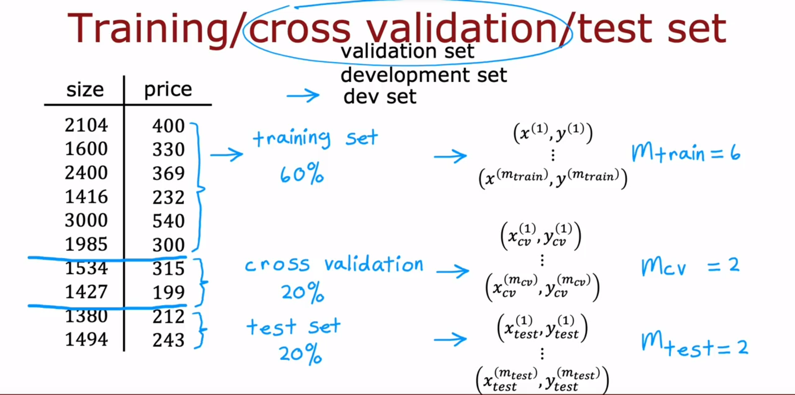
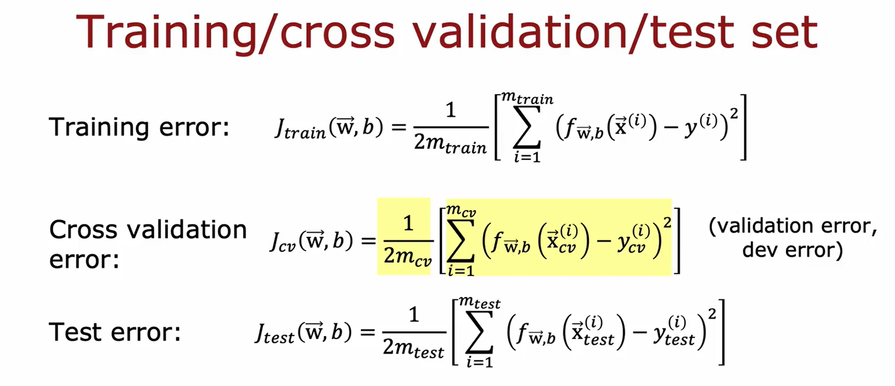

## Bias and Variance

### Diagnosing bias and varience

- Bias refers to underfitting, where the algorithm doesn't perform well on the training set
- Variance refers to overfitting, where the algorithm performs well on the training set but poorly on new data

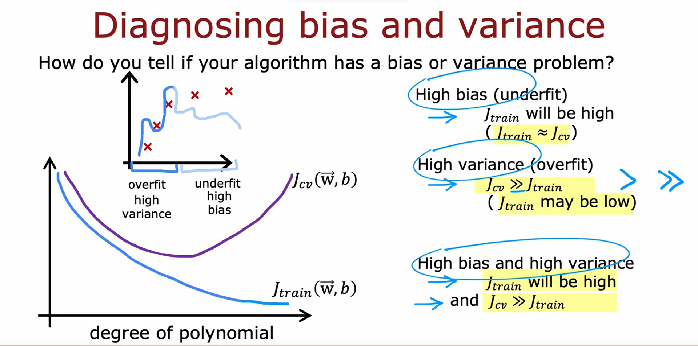

### Regularization bias and variance

- When Lambda is set to a very large value, the algorithm is motivated to keep the parameters small, resulting in high bias and underfitting of the data
- When Lambda is set to a very small value or zero, there is no regularization, leading to high variance and overfitting of the data
- The goal is to find an intermediate value of Lambda that balances the trade-off between keeping the parameters small and fitting the data well
    - Cross-validation can be used to choose a good value of Lambda by trying out different values and evaluating their performance on the cross-validation set
    - By comparing the cross-validation errors for different values of Lambda, you can select the value that gives the lowest error as the best choice for regularization
- The video also explains how training error and cross-validation error vary as a function of Lambda, with high variance on the left and high bias on the right
- Cross-validation helps in selecting a good value of Lambda by finding the point where the algorithm performs best.

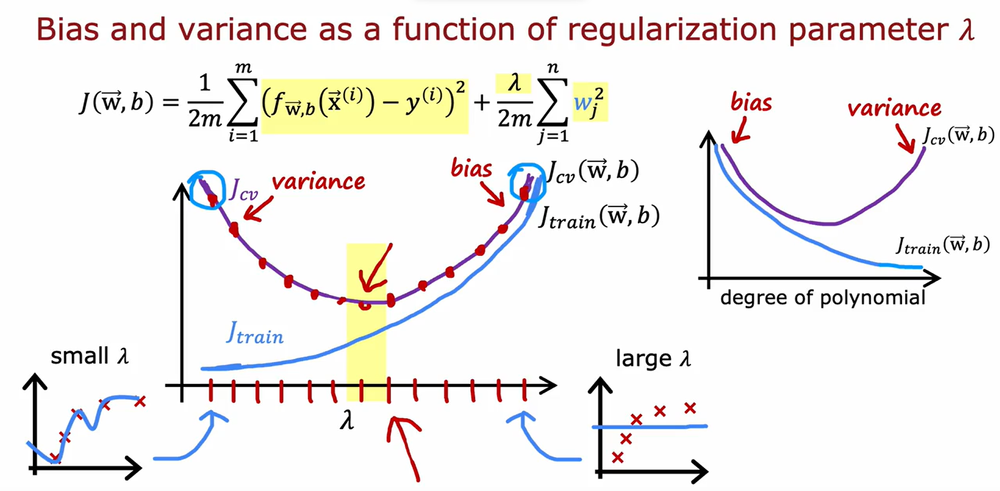

**How to judge if a learning algorithm has high bias or high variance?**

- The **training error** is the percentage of audio clips in the training set that the algorithm does not transcribe correctly
- The **cross-validation error** is the percentage of audio clips in the cross-validation set that the algorithm does not transcribe correctly
- It's important to establish a baseline level of performance, such as human level performance or a competitor's algorithm, to compare the training error and cross-validation error against
- If the training error is much higher than the baseline level of performance, it indicates a high bias problem
- If the cross-validation error is much higher than the training error, it indicates a high variance problem

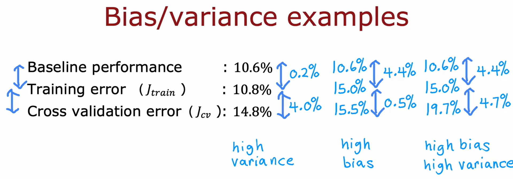

### Learning curves

- Learning curves help us understand how a learning algorithm performs as the amount of training data increases
    - The horizontal axis represents the training set size
    - The vertical axis represents the error
- The cross-validation error (J_cv) decreases as the training set size increases, indicating better model performance
- The training error (J_train) increases as the training set size increases, showing that it becomes harder to fit all training examples perfectly
- When the training set is small, it is relatively easy to achieve low training error
    - However, as the training set size increases, it becomes harder to fit all examples perfectly, leading to an increase in training error

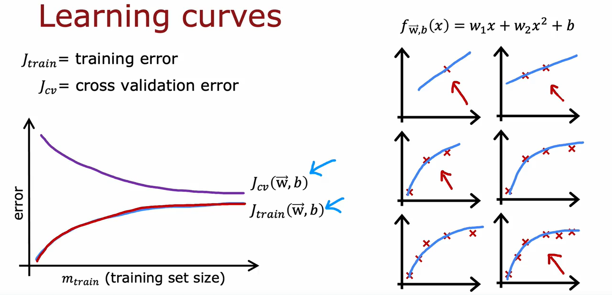

- High bias refers to underfitting, where the model is too simple to capture the underlying patterns in the data
    - For high bias, increasing the training set size does not significantly improve performance

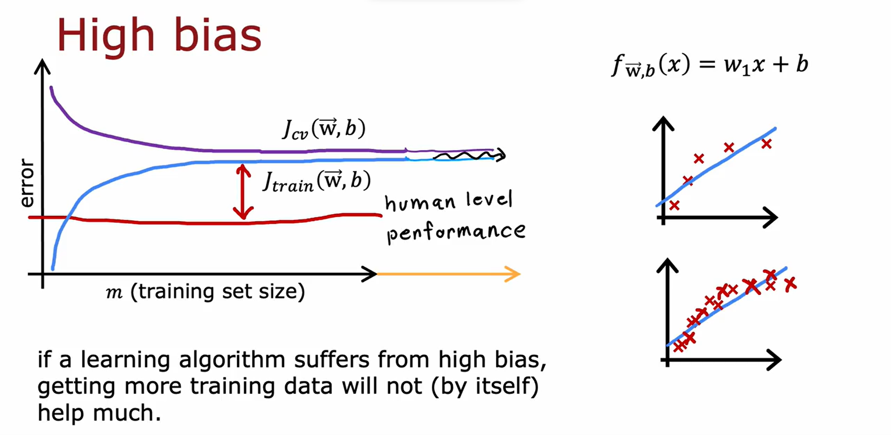

- High variance refers to overfitting, where the model fits the training data too closely and fails to generalize well
    - For high variance, increasing the training set size can help reduce the cross-validation error and improve performance

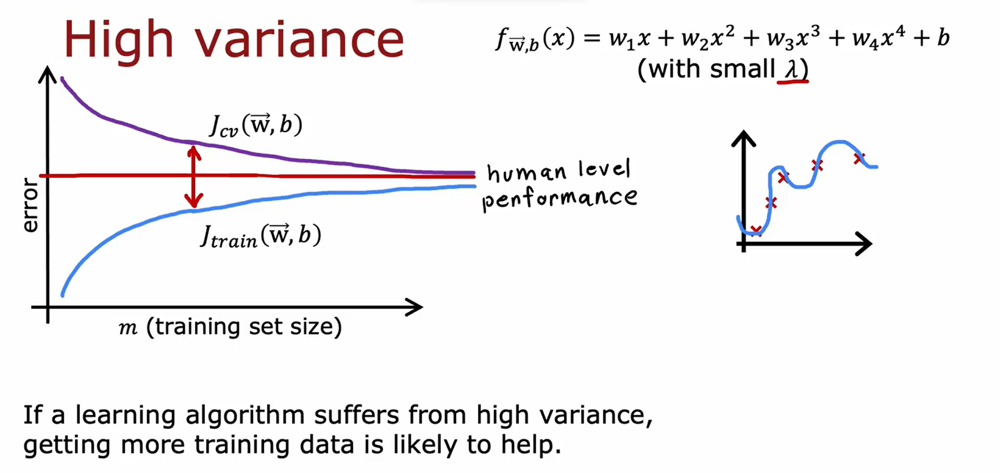

### Summarize
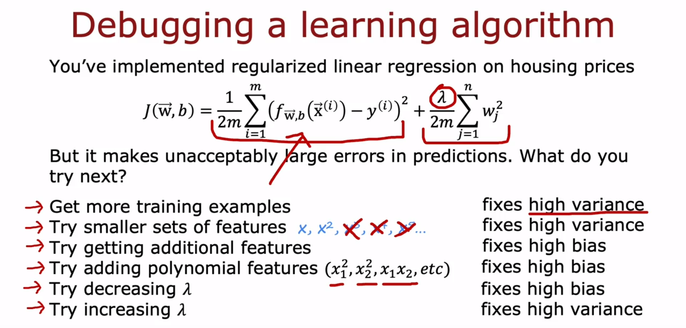
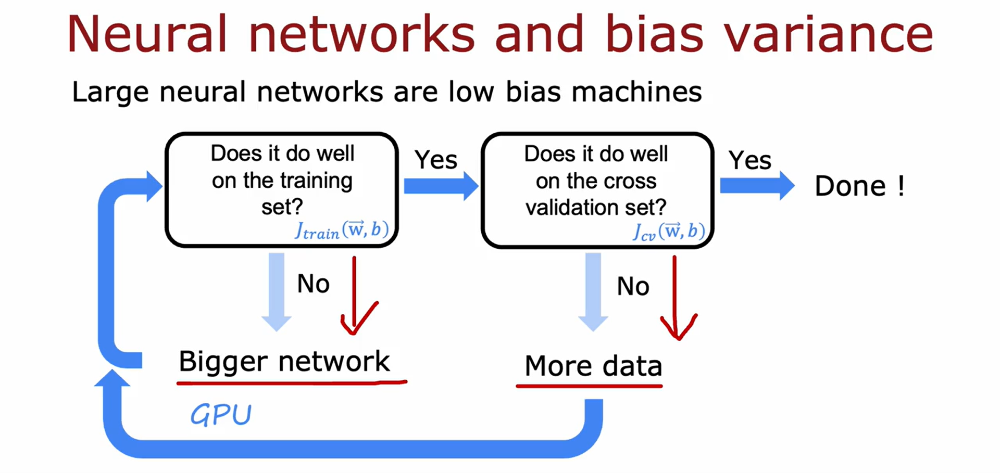

## Iterative loop of ML development

- The first step is to decide on the overall architecture of your system
    - including choosing the machine learning model, selecting data, and picking hyperparameters
- Next, you implement and train the model, it's important to note that the initial model may not work as well as desired
- To improve the model's performance, you can implement diagnostics such as bias and variance analysis and error analysis
- Based on the insights from the diagnostics, you can make decisions like adjusting the neural network size, changing regularization parameters, adding more data or features, or removing features
- You then go through the loop again with the new choices and iterate until you achieve the desired performance

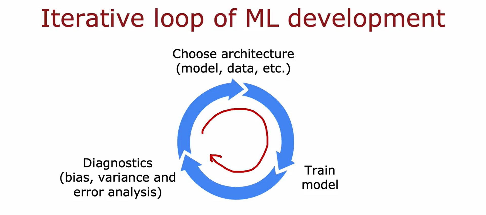

### Error analysis

- Error analysis is an important process to improve the performance of learning algorithms
- It involves manually examining misclassified examples to gain insights into where the algorithm is going wrong
- By grouping misclassified examples into common categories, you can identify patterns and prioritize areas for improvement
- Error analysis can help you determine which types of errors are more common and which ones are rare
- It can guide you in deciding what changes to make to the algorithm or what additional data to collect
- Bias-variance analysis and error analysis are helpful in deciding which changes to the model are more promising to try next
- Error analysis is easier for problems that humans are good at, but it can still be valuable for other tasks
- It can save you time and effort by focusing your attention on the most promising areas for improvement

### Adding data

- It important to focusing on adding more data of specific types that can improve the algorithm's performance
- One technique mentioned is `data augmentation`, which involves modifying existing training examples to create new ones
    - This can be done by rotating, enlarging, shrinking, or changing the contrast of images, or by adding background noise to audio data
- `Data synthesis`, which involves creating brand new examples from scratch
    - This can be done by generating synthetic data using different fonts and colors
- The changes or distortions made to the data during augmentation are representative of the types of noise or distortions in the test set
- It also mentions the concept of `transfer learning`, which involves using data from a different but related task to improve the algorithm's performance
-Focusing on engineering the data used by the algorithm can be more fruitful than solely focusing on improving the code or model

### Transfer learning

Sure! Here's a summary of the video content in bullet points:

- Transfer learning is a technique that allows you to use data from a different task to help with your own application
- The first step in transfer learning is to train a neural network on a large dataset with many different classes
- The parameters of the neural network are learned for each layer, including the output layer
- To apply transfer learning, you make a copy of the neural network and replace the output layer with a smaller layer for your specific task.
- The parameters from the first four layers are used as a starting point for the new neural network.
- There are two options for training the new neural network: Option 1 is to only train the output layer, and Option 2 is to train all the parameters.
- Transfer learning works because the earlier layers of the neural network learn to detect generic features like edges, corners, and shapes.
- Pre-training and fine-tuning are the two steps of transfer learning: pre-training on a large dataset and fine-tuning on a smaller dataset.
- You can download pre-trained neural networks from the internet and replace the output layer for your own task.
- Transfer learning is a way for the machine learning community to share ideas, code, and parameters to improve results collectively.

I hope this summary helps! Let me know if you have any further questions.

Sure! Here is a summary of the video content in bullet points:

- The video discusses the full cycle of a machine learning project.
- The first step is scoping the project and deciding what you want to work on.
- Data collection is the next step, where you gather the necessary data to train your machine learning system.
- After data collection, you can start training the model and carry out error analysis to improve it.
- It is common to go back and collect more data based on the results of error analysis.
- The loop of training the model, error analysis, and collecting more data may continue until the model is considered good enough for deployment.
- When deploying the system, it is important to monitor its performance and maintain it.
- Sometimes, after deployment, you may need to go back and train the model again or collect more data to further improve it.
- The video also mentions the process of deploying a machine learning model in a production environment.
- Software engineering may be needed to implement the model in an inference server and handle API calls.
- MLOps (Machine Learning Operations) is a growing field that focuses on building, deploying, and maintaining machine learning systems.
- The video concludes by mentioning the importance of considering the ethics of building machine learning systems.

I hope this summary helps! Let me know if you have any further questions.