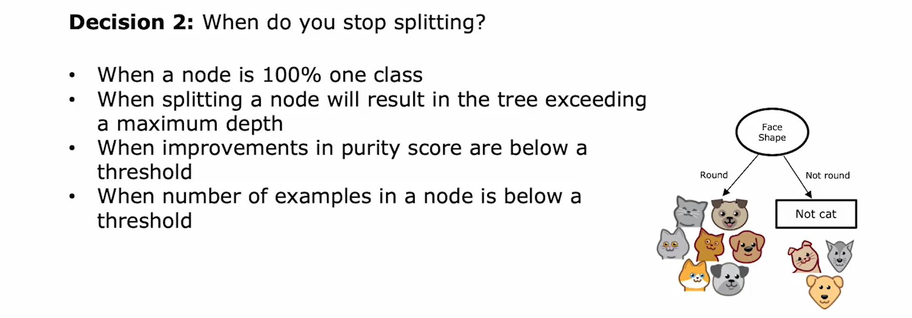

## Decision Trees

- Decision trees as a powerful learning algorithm widely used in many applications
- We uses a cat classification example to explain how decision trees work
  - The dataset used for the example has features like ear shape, face shape, and whiskers, with the goal of predicting if an animal is a cat or not
  - The features X take on categorical values
- Decision trees are represented as a tree-like structure, with nodes and branches
  - Each `node` in the tree represents a decision based on a specific feature
  - `Root node` is the top-most node in the tree
  - `Decision nodes` is nodes that look at a particular feature and then based on the value of the feature, cause you to decide whether to go left or right down the tree
  - `Leaf nodes` make the final prediction, in this case, whether the animal is a cat or not

### How it works?

The process of building a decision tree involves several steps.

- The first step is to decide which feature to use at the root node of the decision tree.
  - In this example, the ear shape feature is chosen as the root node feature.
- The training examples are then split based on the value of the ear shape feature.
  - The left branch of the decision tree focuses on the examples with pointy ears
  - The right branch focuses on the examples with floppy ears.
- The next step is to decide what feature to use on the left branch to further split the examples
  - In this example, the face shape feature is chosen for the left branch.
  - The examples with a round face shape are moved to the left
  - The example with a not round face shape is moved to the right.
- Finally, leaf nodes are created to make predictions based on the purity of the subsets of examples
- This learning algorithm makes key decisions on which features to split on and when to stop splitting

- The algorithm aims to maximize purity in the subsets of examples to make accurate predictions.
- The decision on which feature to split on is based on the purity of the labels in the left and right sub-branches.

- The decision on when to stop splitting can be based on criteria such as maximum depth, improvements in purity, or the number of examples at a node.

### Measuring purity

- Entropy is used to measure the impurity of how pure or impure a set of examples is.
- The entropy function is denoted as H(p_1), where p_1 is the fraction of examples that belong to a certain class.
    - When the fraction of positive examples is 0 or 1 (i.e., all examples are either positive or negative), the entropy value is 0. This means that the set of examples is completely pure and there is no impurity or uncertainty in the classification.
    - As the fraction of positive examples approaches 0.5 (a 50-50 mix of positive and negative examples), the entropy value increases and reaches its maximum value of 1. This indicates that the set of examples is most impure or uncertain, as it is equally divided between the two classes.
    - When the fraction of positive examples is closer to either 0 or 1, the entropy value decreases, indicating a higher level of purity or certainty in the classification. In other words, as the set of examples becomes more skewed towards one class, the entropy decreases.

- The entropy function is defined as below, where p_0 is the fraction of examples that do not belong to the class
- The entropy function ranges from 0 to 1, with 0 indicating a pure set (all examples belong to one class) and 1 indicating a completely impure set (equal number of examples from both classes)

### Choosing a split: Information Gain

How to deciding what feature to use at the root node of a decision tree for recognizing cats versus not cats?
- Compares the entropy values for different features (ear shape, face shape, whiskers) to determine which one results in the lowest average weighted entropy

Example calculation

$H(p) = -p \log_2(p) - (1-p) \log_2(1-p)$

For $H(0.8)$, we will substitute $p = 0.8$

$H(0.8) = -(0.8) \log_2(0.8) - (1-0.8) \log_2(1-0.8) = 0.722$

$\frac{5}{10} H(0.8) = \frac{5}{10} 0.722 = 0.361$

- Below is information gain formula

### Summarize: Putting it together

### Using one-hot encoding of categorical features
How to handle features that can take on more than two discrete values?
- One way to address this is by using one-hot encoding.
- `One-hot encoding` involves creating new binary features for each possible value of the original feature.
- Each new feature can only take on the values 0 or 1.
- The method is called one-hot encoding because exactly one of the new features will have a value of 1, while the others will have a value of 0.
- This technique can be used not only for decision tree learning but also for training neural networks, logistic regression, and linear regression.
- It allows you to encode categorical features using ones and zeros, which can be fed as inputs to a neural network.
- One-hot encoding is a useful technique for handling features with more than two discrete values.

### Continuous valued features

## Tree Ensembles

- Decision trees can be sensitive to small changes in the data.
- To make the algorithm more robust, we can build a collection of multiple decision trees, called a `tree ensemble`.
- Each decision tree in the ensemble may have a different split at the root and different sub-trees.
- By having multiple trees vote on the final prediction, the ensemble becomes less sensitive to the individual trees' predictions.
- The ensemble's final prediction is based on the majority vote of the individual trees.
- Sampling with replacement is a key technique used to create different decision trees for the ensemble.
- Sampling with replacement involves randomly selecting training examples from the dataset, allowing for slight variations in the trees.
  

### Sampling with replacement

- Sampling with replacement means picking a token from a bag, noting its color, and then putting it back in the bag before picking again.
- The video demonstrates multiple rounds of sampling with replacement, showing that the same token can be picked multiple times and others may not be picked at all.
- The concept of sampling with replacement is then applied to building an ensemble of trees in machine learning.
- In the context of building an ensemble of trees, sampling with replacement involves creating multiple random training sets that are slightly different from the original training set.
- The process involves randomly picking training examples from the original set, putting them back in the bag, and repeating the process until a new training set of the same size is created.
- The new training set may contain repeated examples and may not include all the original examples, but this is part of the sampling with replacement procedure.
- Sampling with replacement allows for the construction of a new training set that is similar to the original but also different, which is important for building an ensemble of trees.

## XGBoost

- The most commonly used algorithm for decision tree ensembles is XGBoost.
- XGBoost is open source, runs quickly, and has been successful in machine learning competitions and commercial applications.
- Boosting is a technique that focuses on examples that the ensemble of trees is not yet classifying well.
- XGBoost assigns different weights to training examples instead of using sampling with replacement.
- XGBoost has built-in regularization to prevent overfitting.
- XGBoost is often used in machine learning competitions and is highly competitive.
- Implementing XGBoost can be complex, so many practitioners use open source libraries.
- To use XGBoost, you import the XGBoost library, initialize a model as an XGBoost classifier, and make predictions using the model.
