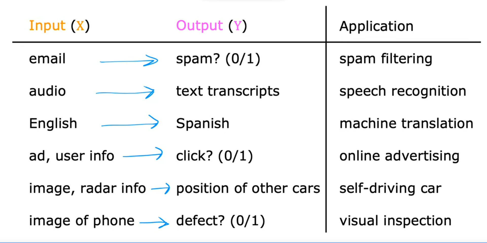

# Supervised vs Unsupervised Learning

## What is Machine Learning

- Ability for machine to learn without explicitly being programmed
- The two main types of machine learning: **Supervised learning** and **Unsupervised learning**
- Supervised learning used most in the real world applications
- Three courses in total
    - First and second courses will focus on supervised learning (regression and classification)
    - Third will focus on unsupervised learning, recommender systems, and reinforcement learning

## Terminology

- Data used to train the model is called the `training set`
- `Train` the model to `learn` from the `training set` so it can make a `predict` 
- `x` = input variable
  - Also called a `feature` or `input feature`
- `y` = output variable
  - Also called the `target variable` 
- `m` = number of training examples
- `(x, y)` = single training example
- To reference a specific row (x(i), y(i)) = ith training example
  - i = specific row in table
  - i is an index

## Supervised Learning Part 1

- Most economic value created through supervised learning
- Algorithms that learn `input -> output` mappings
    - output is called the `labeled`
- Learns from being given the example or "right answers" 
  - Is given examples that show input `x` and corresponding `output label` y
  - Learns to take just the input alone without the output label and gives a reasonably accurate prediction or guess of the output.
- Once it's trained, can predict unseen data or new input and try to create the correct output
- Below is the example of the applications

- House price prediction is a typical example of `Regression`
- In house price example, the house size is the input and the price of the house would be the prediction

> **Regression is predict a number out of infinitely many possible output**

## Supervised Learning Part 2

- Classification: Breast cancer detection
  - Tries to figure out if a tumor is malignant or benign
  - The output here would be benign (0) or malignant (1)
  - This is specifically *binary classification*
  - Used to predict *categories*
- Note: this is different from regression because regression tries to predict a number out of an infinite number of possibilites
  - Classification there are a set number of outcomes to be chosen from
- There can be multiple *categories* to choose from in classification
- Some terminology, *class* and *category* are used interchangeably for the output that the model produces in a classification problem
- Categories don't have to be numbers. It could be non numeric for example, it can predict whether a picture is that of a cat or a dog
- The utput categories such as 0, 1 and 2 but not all possible numbers in between like 0.5 or 1.7

> **Classification is predict categories out of finite limited set or small numbers of possible output**

## Unsupervised Learning Part 1

- Given data that isn't associated with any output labels
- Find something interesting in **unlabeled** data, like pattern or structure
- Unsupervised because we're not trying to produce some "correct" output
- Instead, we asked to figure out all by yourself what's interesting, what patterns or structures that might be in this data
- Your unsupervised learning might decide that your data can belong to 2 different `clusters`
  - Used in google news to groups related news together
  - Many businesses have huge dbs of customer data, group customers in different ways to better serve them and understand them
- With clustering, the unsupervised learning algorithm will try to group data points together in certain clusters

## Unsupervised Learning Part 2

- In unsupervised learning, data has only inputs x, but not output labels y
- Job is for unsupervised learning to find structure in the data
- **Clustering**
  - Group similar data points together
- **Anomaly detection**
  - Find unusual data points
  - Useful for fraud detection
- **Dimensionality reduction**
  - Compress data using fewer numbers without losing value