## Training the model with Gradient Descent

### Gradient Descent

- This is the systematic way to minimize w and b
- Used heavily in machine learning
- Gradient descent can be used to minimize any function, not just the cost function for linear regression
- Outline
  - Start out with some initial guesses for w and b
    - Doesn't matter what initial values, commonly both are set to 0
  - Keep changing w,b to reduce J(w, b) until we settle at or near a minimum
    - J is not always a parabola with a single minimum
    - Linear regression with a cost function using squared error cost function will always be a bowl shape

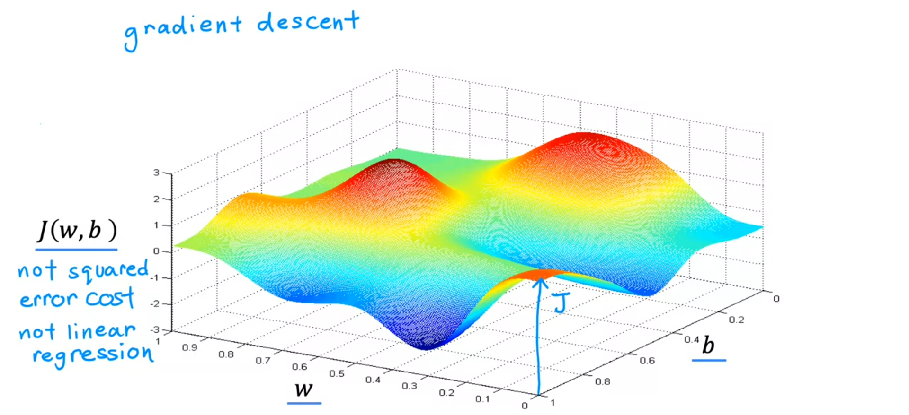

- Want to get from hill to valley as fast as possible
- If I want to take a baby step and get down hill to valley as quickly as possible, what direction do we go?
  - This repeats until we hit a minimum

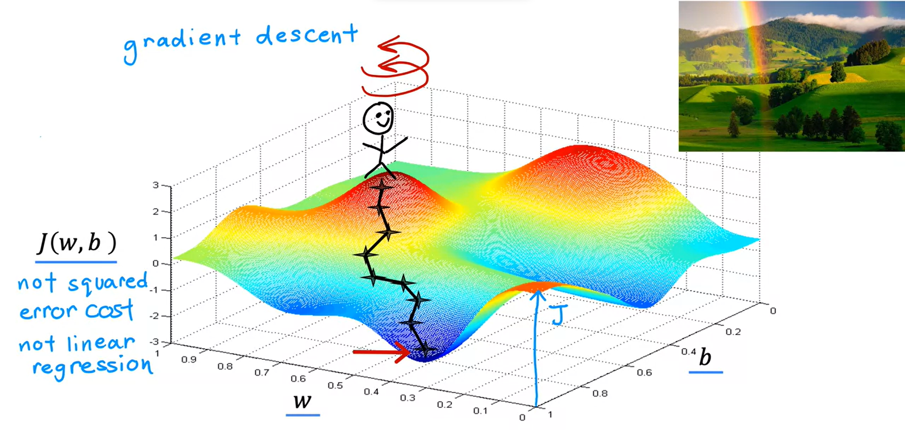

- What if you started in a different location?
- We may end up in a different valley
- These 2 valleys are called `local minima`

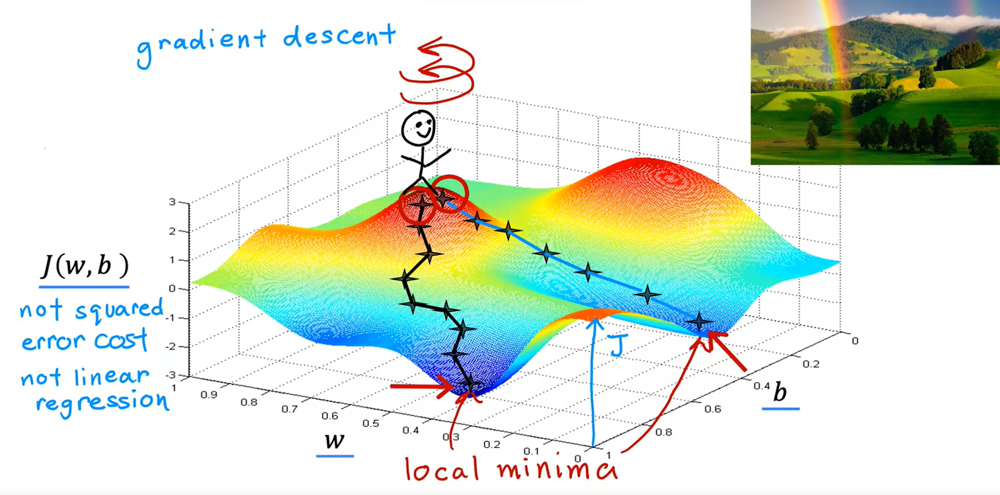

### Implementing Gradient Descent

- Update your parameter `w` by taking the _current_ value of `w` and adjusting it a small amount

  - _Alpha = learning rate_

    - Small positive number between 0 and 1
    - Controls how big of a step we take downhill during gradient descent

    Note:

    - If Alpha is very large, then that corresponds to a very aggressive gradient descent procedure where you're trying to take huge steps downhill
    - If Alpha is very small, then you'd be taking small baby steps downhill.
    - We'll come back later to dive more deeply into how to choose a good learning rate Alpha

  - Partial derivative of `J(w,b)` with respect to `w`
    - Which direction you want to take your step
    - Also determiens size of step we take downhill (along with learning rate)

- There is a similar formula for `b`
  - Partial derivative happens with respect to `b` in this case
- Repeat these operations until we have convergence
  - This means that we reach the point at a local minimum where `w` and `b` do not change very much reach with each additional step that you take
- Want to update both `w` and `b` simultaneously (at the same time) to new value

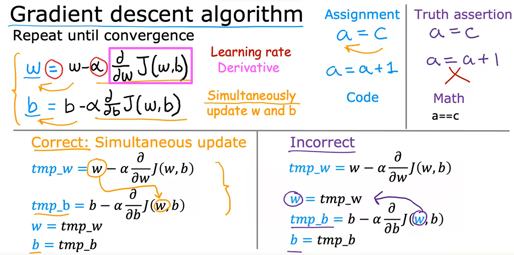

### Gradient descent intuition

- The learning rate α is always a positive number
  - If you take W minus a positive number, you end up with a new value for W that is smaller
  - If you take W minus a negative number, you end up with a new value for W that is larger

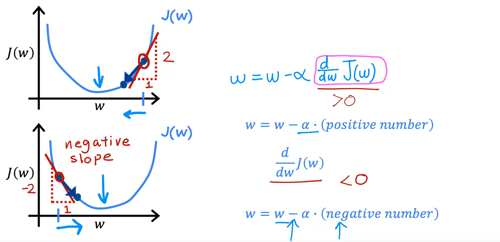

### Learning Rate

- This has a huge impact on efficiency of your implementation
- If chosen poorly, gradient descent may not work at all

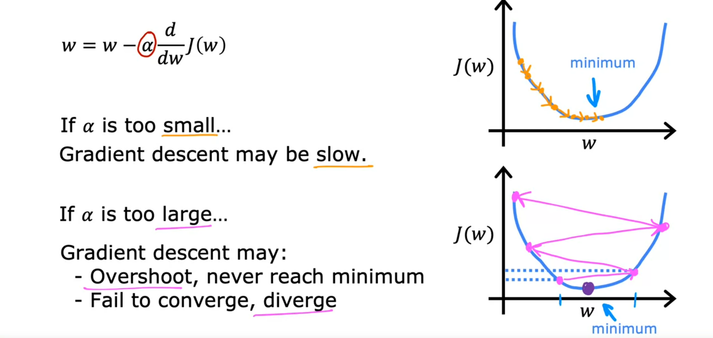

- What if you've chosen a w so that you're already at a local minimum?
  - Gradient descent will leave `w` unchanged

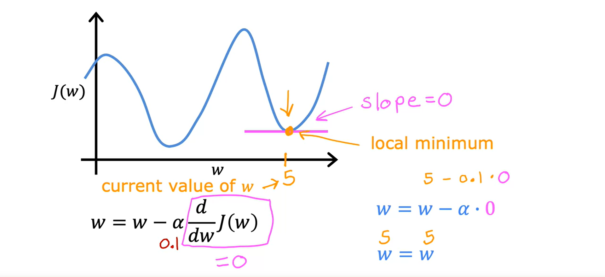

- As we get closer to the local minimum, the steps become smaller because the derivative is smaller leading to a smaller change in w

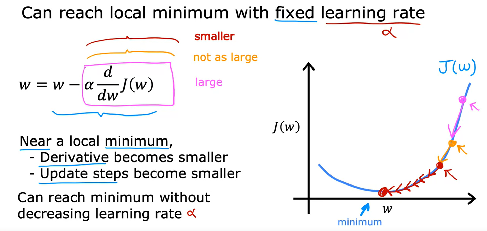

### Gradient Descent for Linear Regression

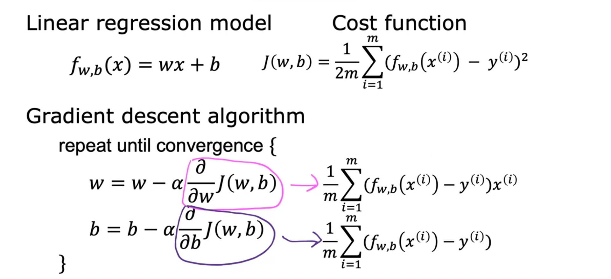

- Gradient descent can lead to a local minimum instead of a global minimum
- When you use a squared error cost function, there will NEVER be multiple local minimum, there is only a single global minimum
  - This is because the squared error cost function produces a bowl shaped cost function
- Informally, a convex function is of bowl-shaped function and it cannot have any local minima other than the single global minimum.

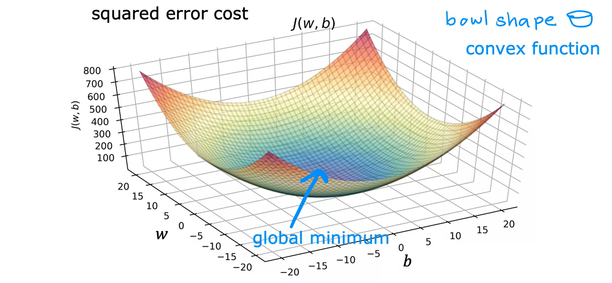

### Running Gradient Descent

- Now we start taking steps to move to the minimum (from cost: 77237)
- As we take more of these steps, the cost is decreasing at each update (until cost: 2311)

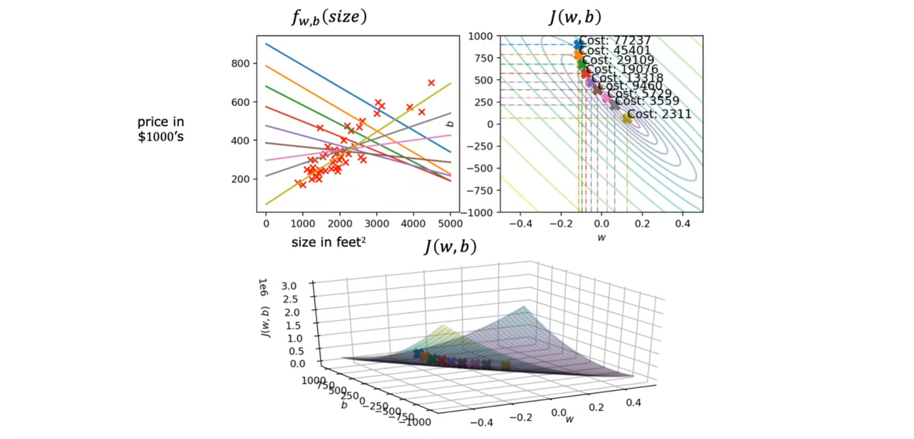

- This gradient descent process is called `batch gradient descent`
  - `Batch` means that for each step of gradient descent uses all of the training examples for each update

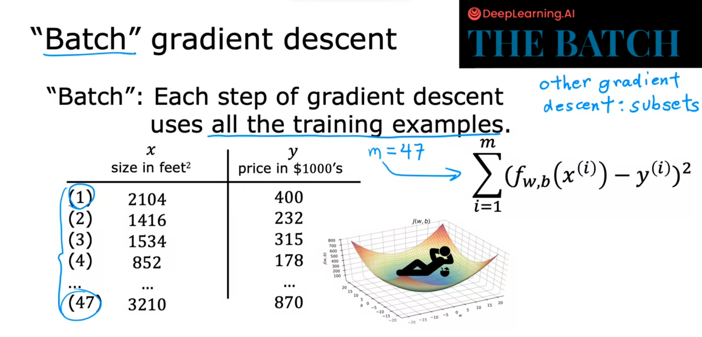
