## Linear Regression Model Part 1

### Linear Regression with One Variable

- Linear regression just means fitting a straight line to your data
- Probably most widely used learning model
- Below uses square feet to indicate the price of the house
  - X = size in square feet
  - Y = price of house

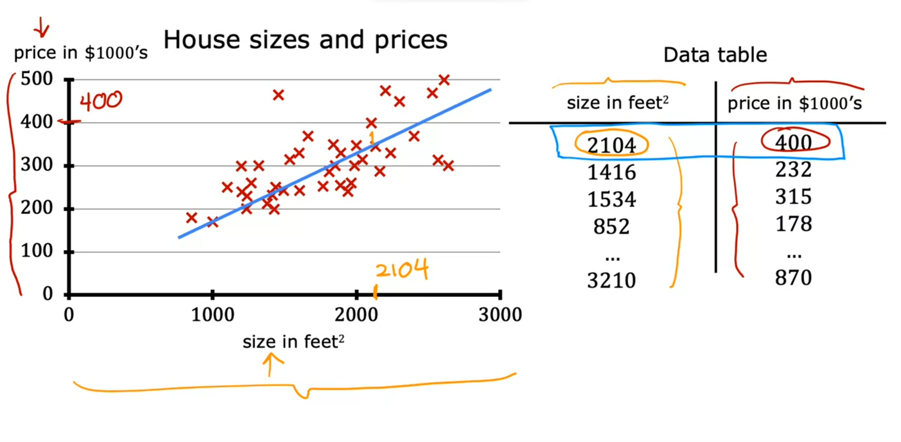

## Linear Regression Model Part 2

- Training set includes *input features* and *output targets*
- Then your supervised learning algorithm will produce some function (f) or hypothesis
- The job of this function is to take new data (a new set features or x) and output or predict a result (y_hat)
- y_hat is the prediction that the function outputs
  - Another way to say this is that y_hat is the estimate or prediction for what the real output variable y will be (which we won't know at the time for something like a house value until the house is sold)
- The function f is called the model
- When the symbol is just the letter y, then that refers to the target, which is the actual true value in the training set

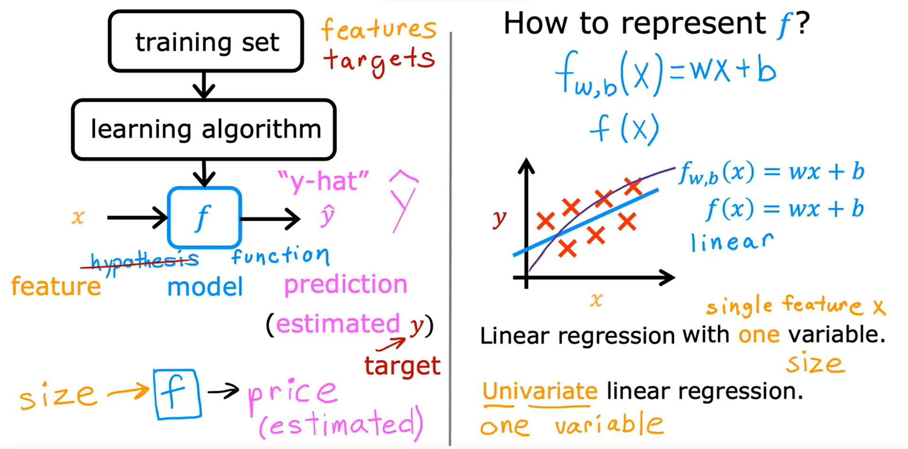

- Now how do we represent the `f` is?
- This `f`f or `f_w,b(X)` is also same as `f(X)`
- So `f` will take some input x and depending on values w and b, f will output some value as a prediction (y_hat)
- w = weight
- b = bias
- Linear is a good way to start before going to a more complex model
- Single variable linear regression is sometimes called univariate linear regression

## Cost Function Formula

- Tells us how well the model is doing so we can try and make the model better
- The model you're going to use to fit this training set is this linear function
- `w` and `b` are called the parameters of the model
  - Parameters can be adjusted during training
  - Also referred to as `coefficients` or `weights`

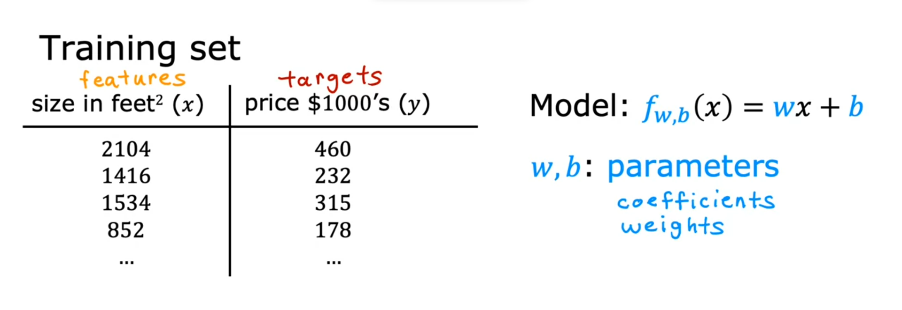

- What do `w` and `b` do?

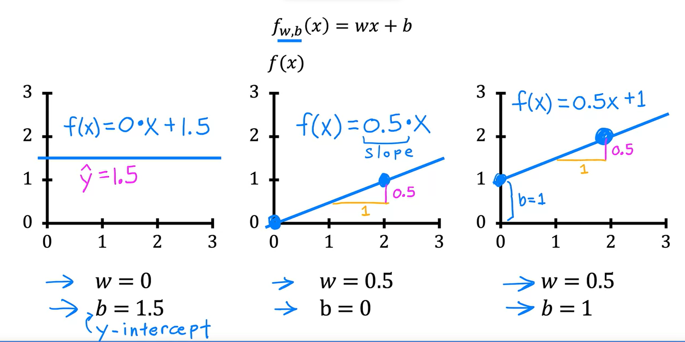

- Now, how do you find values for w and b so that the prediction y hat i is close to the true target y^i for many or maybe all training examples x^i, y^i
- First take a look at how well a line fits the training data
- To do that, we're going to construct a cost function

1. The cost function takes the prediction `y_hat` and compares it to the target `y` by taking `y_hat - y`. This difference is called the `error`, we're measuring how far off to prediction is from the target. 
2. Next, let's computes the square of this error.
3. Then measure the error across the entire training set.
4. To build a cost function that doesn't automatically get bigger as the training set size gets larger by convention, we will compute the average squared error instead of the total squared error and we do that by dividing by `m`. 
6. Divides by 2 times m. The extra division by 2 is just meant to make some of our later calculations look neater (optional)

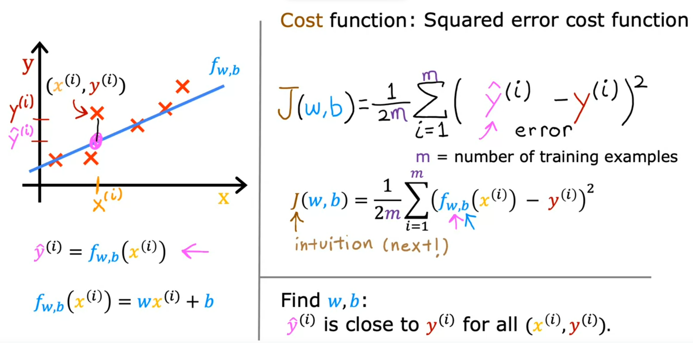

### Cost Function Intuition

- We have cost function to measure how well a choice of `w` and `b` will fits the traning data
- What the cost function J does is, it measures the difference between the model's predictions, and the actual true values for y
- We want to minimize the cost (`J(w, b)`)
- Below is a simplified cost function where `b = 0`

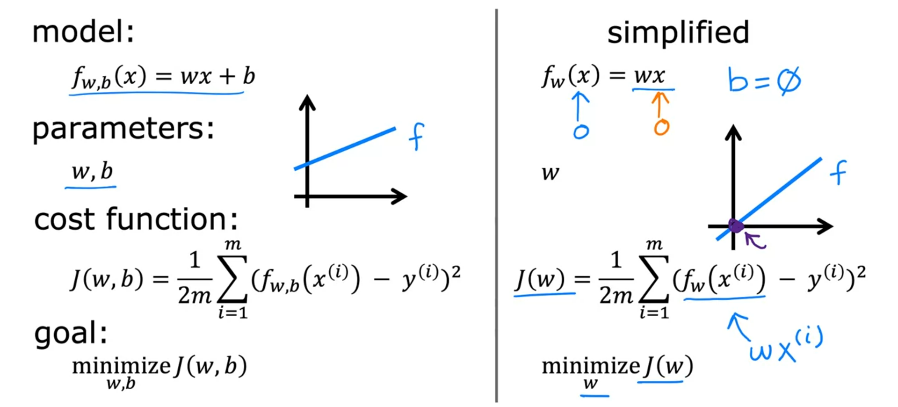

- Below is an example where we have a perfectly fit line to our training example, `w = 1` and we get the cost function is 0, `J(w) = 0`
- In the graph on the right side, note that `J(1) = 0` because our cost function was 0 when `w = 1`

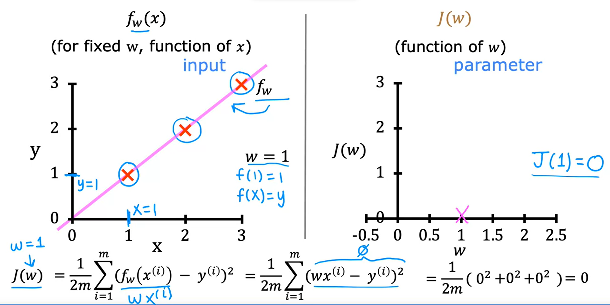

- Below is 2 example where we have `w = 0.5` and `w = 0` which is not perfectly fit

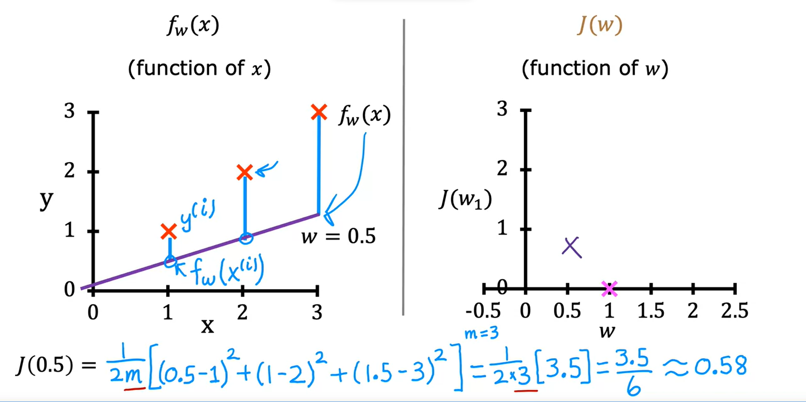 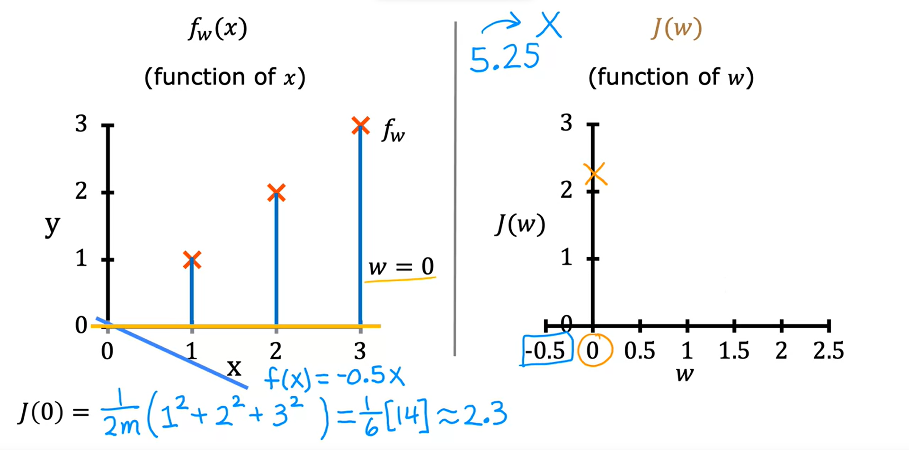

- We can keep doing this for many many values of `w`
- By continuing to do this calculation, we can create find what the cost function J looks like
  - Each value of parameter `w` corresponds to a different fitting line in f(x)
  - So for each point on the J(w) graph, you have a corresponding line for f(x)
- We want to choose `w` that minimizes `J(w)`
  - Following this example, we would choose `w = 1` because `J(w) = 0` here

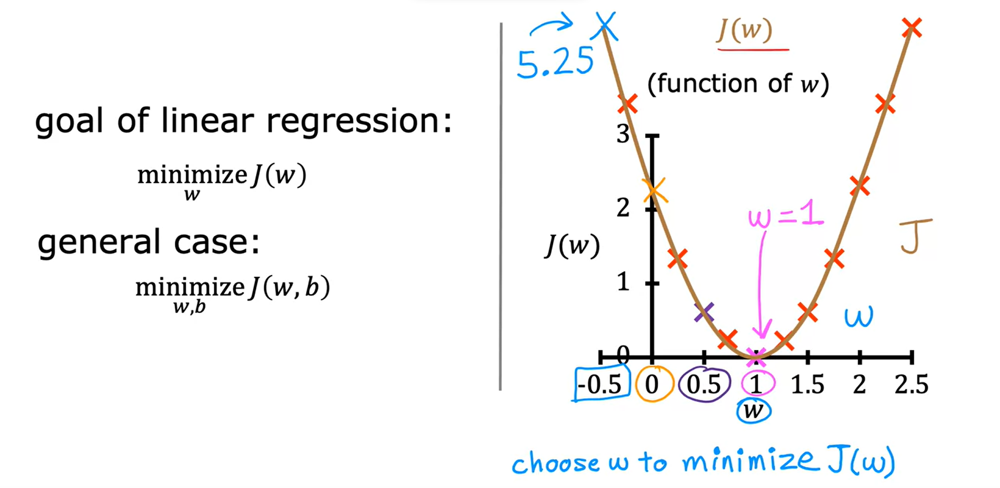

### Visualizing the Cost Function

- When we have both w and b (b != 0)
  - Note that this is the 3D version of the graph we had when b = 0
- As w and b are varied, get different values for the cost function `J`
  - Any point on this graph is a particular selection of w and b

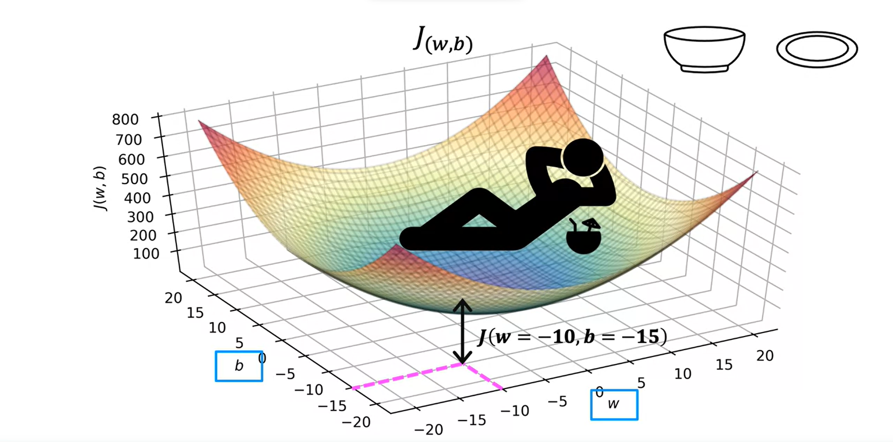

- These 3D plots can be generated as a 2D contour plot to better visualize the cost function and to see the minimum

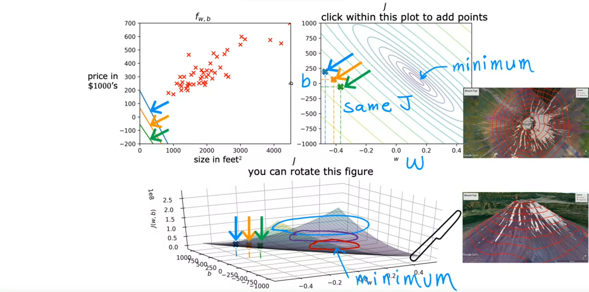

### Visualization Examples

- Note where w and b intersect on the cost function taht is far from the minimum, it's not a good fit to the training set

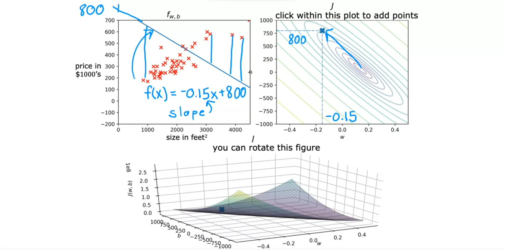

- Example with cost function close to the minimum

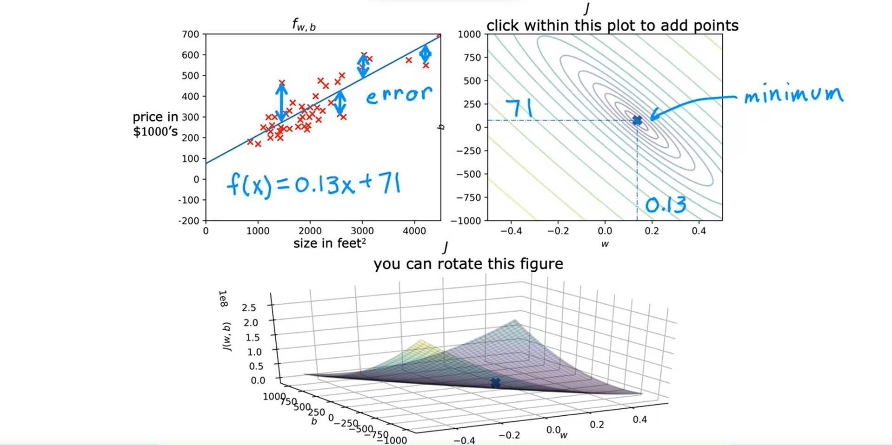