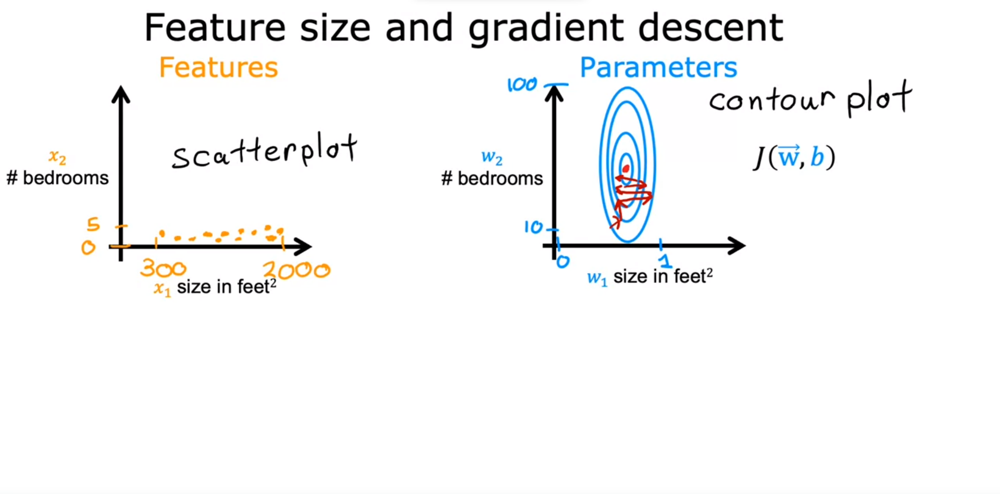

### Feature Scaling Part 1

- Enables gradient descent to run much faster
- The relationship between the size of a feature that is how big are the numbers for that feature and the size of its associated parameter.
- In below example, size of house has relatively large range (300-2000) and number of bedrooms has small range (0-5)
- Actual cost of house is 500k

- When possible values of feature are small, reasonable value for parameters are relatively large
- This shows the relationship between the range of values for a feature and what happens to changes in the weight of that feature
  - Changing the weight of w1 for square footage has a big change in the cost function
  - Larger change is required to w2 in order to change the prediction as much so large values to w2 do not change the cost function that much 

- With gradient descent, because the ovals are so tall and skinny, we may bounce back and forth before finding the global minimum (not effective)

- In situations like this, it's useful to *scale* the feature
  - This means performing some transformation of your training data
  - x1 say might now range from 0 to 1
  - x2 might also range from 0 to 1

- To summarize, when you have different features that take on very different ranges of values, it can cause gradient descent to run slowly - rescaling so all features have a comparable range of values can solve this issue

### Feature Scaling Part 2

- How to actually scale features to have comparable ranges of values to each other?
- (1) *Divide by Maximum* : divide the range by the maximum so you get ranges between 0 and 1

- (2) Can also do *Mean Normalization*
- Center the values around 0
  - Typically from -1 to 1

- (3) or *Z-score normalization*
- Calculate standard deviation of each feature (use mean and std)

- When performing feature scaling, the rule of thumb is we want to aim for *-1 <= xj <= 1* for each feature xj
- But these values, can be a little bit loose
- All of these range also are completely okay
- When it doubt perform feature scaling, it's not going to cause harm

### Checking Gradient Descent for Convergence

- When running gradient descent, how can you tell if it is converging? is it helping you to find parameters close to the global minimum of the cost function?
- We must recognize what a well-running implementation of gradient descent looks like and be better able to choose a good learning rate Alpha
- Job of gradient descent is to find parameters w and b that minimize the cost function *J*
- Remember that each iteration means after each simultaneous update of the parameters w and b

- Note with the above that if there is ever an *increase* in *J* as we increase iterations, we need to test a new learning rate
  - The learning rate may be too large or there could be a bug in the code
- Note that the cost of *J* begins leveling off as interations increase
- Number of iterations for convergence can vary greatly across applications

 

- You can also use an *automatic convergence test* 
- Choosing the right value for epsilon can be difficult

### Choosing the Learning Rate

- If the learning rate is too slow, gradient descent will run very slowly
- If the learning rate  is too large, gradient descent may not converge
- Below is an example of an issue
  - Issue may be a bug in code or that learning rate is too large
    - An example could be `w1 = w1 + alpha(d1)`
    - It should be a `-` instead of a `+`
  - Bottom graph shows that we are moving away from the minimum
    - It is because the learning rate is too big, the cost go up instead of decreasing
    - To fix it, use a smaller learning rate
    - Try a range of values and run gradient descent for small number of iterations
- If the cost function is increasing, we know that gradient descent is diverging

### Feature Engineering

- Choosing the right features is a critical step to making the algorithm work well
- This is how you can choose or engineer the most appropriate features for your learning algorithm
- With housing prediction, say you have two features for each house. 
- x_1 is the width of the lot size of land the house : *frontage*
- x_2 is the depth of the lot size of land the house : *depth*
- It may be better to have a single feature *area* as opposed to having that broken up between *frontage* and *depth*
  - Creating a new feature like this is called *feature engineering*
    - Usually done by transforming or combining the original features
    - This can result in a better model

### Polynomial Regression

- Let you fit curves, non-linear functions, to your data. 
- Nonlinear functions for data
  - Quadratic function
  - Cubic function
  - Etc...
- If we have features that are squared or cubed, feature scaling becomes more important so we have features into comparable ranges of values
- We have a choice in what features you use. By using feature engineering and polynomial functions, you can potentially get a much better model for your data.

 

- When running gradient descent, it will help pick the "correct" features for you
  - The less weight a feature has, the less important it is
- Imagine we have a formula like
  - w0x0 + w1x1^2 + w2x2^3 + b
  - After gradient descent if
    - w0 = 0.08
    - w1 = 0.54
    - w2 = 0.03
    - b = 0.0106
    - Weight of w1 much greater than w2