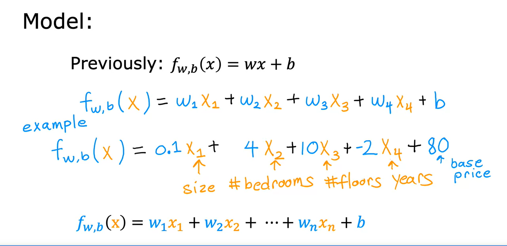

## Multiple Features

- Original linear regression we had one feature
- What if we did not only have the size of the house as a feature?
- But also knew the number of bedrooms, the number of floors, and the age of the home in years. It seems like this would give a lot more information with which to predict the price

- Note that a row of features is sometimes called a `row vector`
  - A vector here is basically the same thing conceptually as an array of values
  - A row vector has all of the features values for that particular example

 

- Each feature will have it's own weight, so some features will contribute more to the price than the other, for example
  - Some features may INCREASE the value of the house, like price in size, bedroom, or floor
  - Some features may DECREASE the value of the house, like price in years
  - b = 80, the base price of a house starts off at maybe $80,000, assuming it has no size, no bedrooms, no floor and no age

- The vector weights and b are the _parameters_ of the model
- We can do `vector_w * vector_x` (dot product of 2 vectors) to simplify the expression
- This is called **Multiple Linear Regression**
  - Note that this is NOT multi-variate regression

### Vectorization Part 1

- Makes code shorter and makes it run more faster and efficiently
- Enables usage of things like GPUs and modern numerical linear algebra libraries
- Below are 2 examples without vectorization and 1 with vectorization
- With vectorization
  - Makes code shorter
  - Results in code running much faster than 2 non-vectorization implementation
  - Numpy dot function uses parallel computing to make things faster

### Vectorization Part 2

- Vectorization scales well to large datasets and modern hardware

- Below is gradient descent without and with vectorization side by side
- With factorization, you can imagine the computer's parallel processing hardware like this
- It takes all 16 values in the vector w and subtracts in parallel, 0.1 times all 16 values in the vector d, and assign all 16 calculations back to w all at the same time and all in one step

### Gradient Descent for Multiple Linear Regression

- Below is gradient descent for multiple linear regression
- The formula for the derivative of J with respect to w_1 on the right looks very similar to the case of one feature on the left
- The error term still takes a prediction f of x minus the target y
- One difference is that w and x are now vectors and just as w on the left has now become w_1 here on the right, xi here on the left is now instead xi _1 here on the right and this is just for J equals 1
- On multiple linear regression, we have J ranging from 1 through n and so we'll update the parameters w_1, w_2, all the way up to w_n, and then as before, we'll update b.

#### An alternative to gradient descent

- Alternative to finding w and b for multiple linear regression
- Uses the _normal equation method_
  - Works only for linear regression
- Solves all in 1 go without multiple iterations
- Slow when number of features is large
- Machine learning libraries may use this behind the scenes

