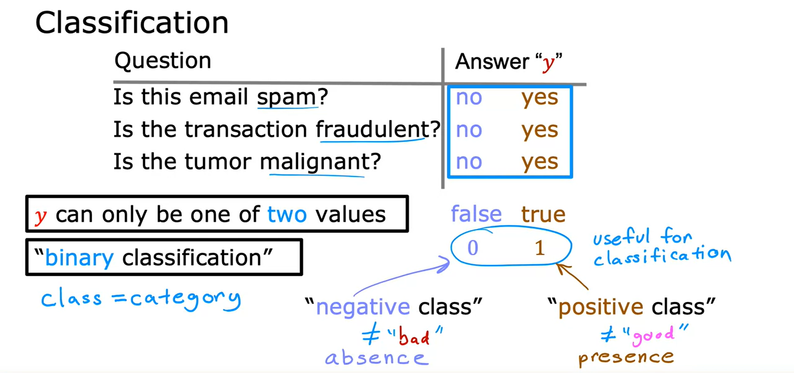
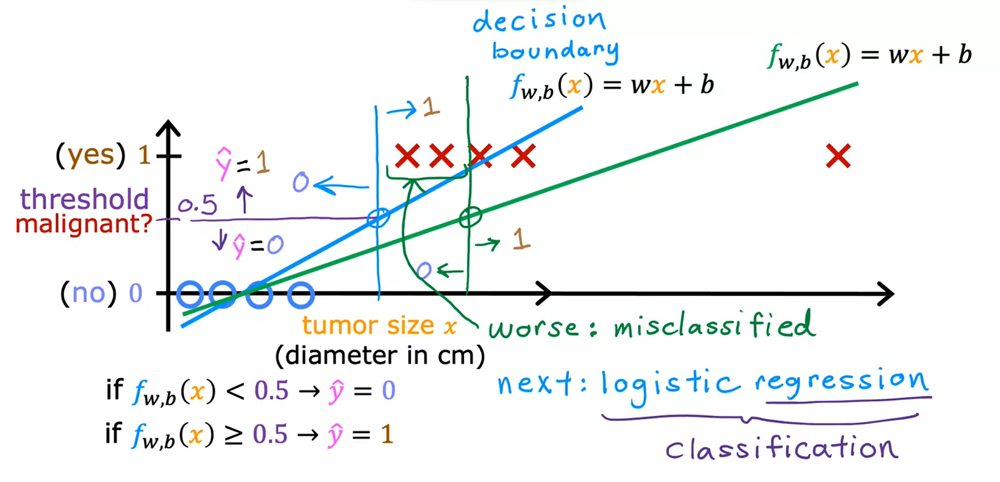
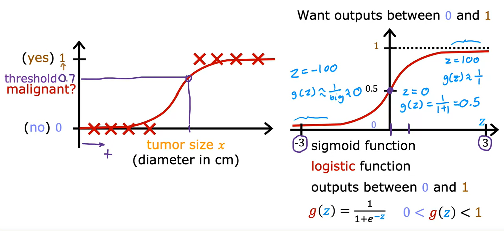
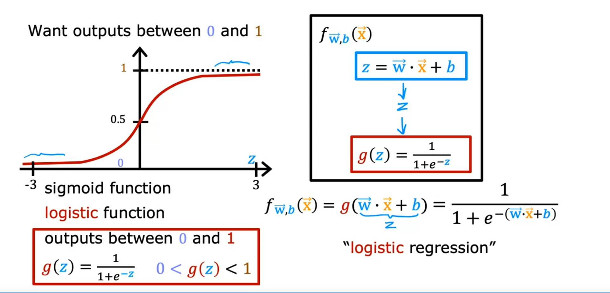
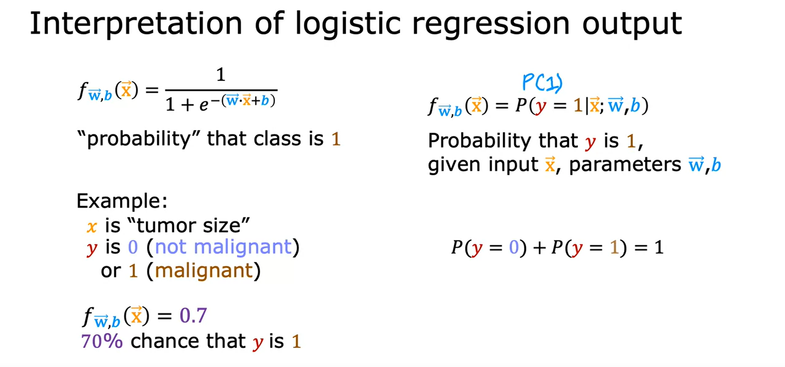
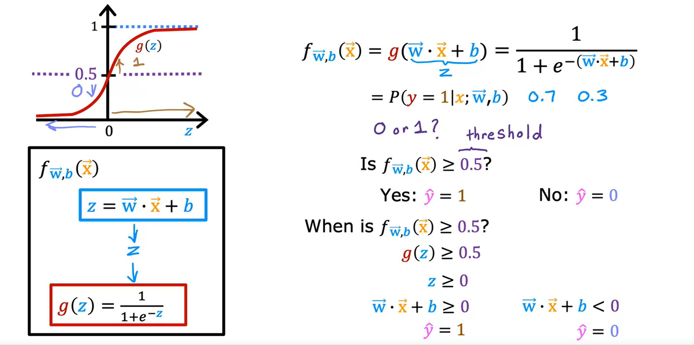
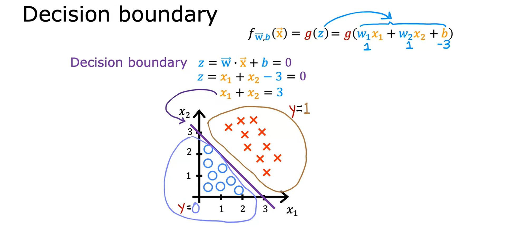
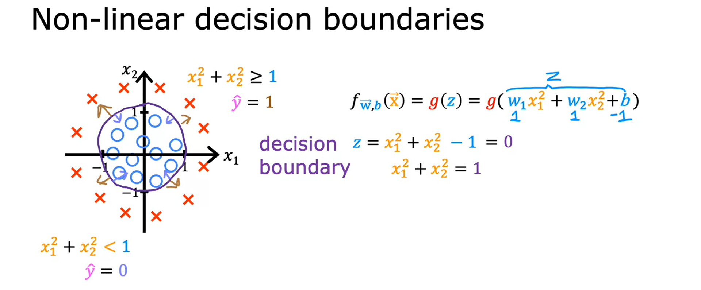
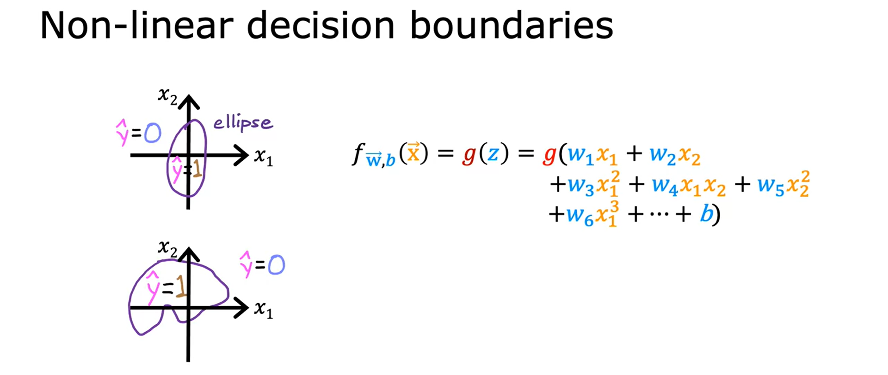

## Classification

- Output variable value can take on 1 of a small range of values
- Binary classification: y can only be one of two values (0 and 1)
- Class and category are used interchangeably

- Example for training set for malignant tumor

  - If you tried to use linear regression here, it can be any possible real number - not just 0 or 1
  - Could try and use a threshold to decide what becomes 0 and what becomes 1

- Now if a new `x` is added, it will shift the line and shifts what we identify as 0 or 1
  - We now have `x`'s that are misidentified
  - `Decision boundary` is now in a bad location
- _Logistic Regression_ is used for classification problems and removes these issues

### Logistic Regression

- Continuing example of determining if a tumor is malignant
- We saw that linear regression is not a good algorithm for this problem
- Logistic regression will fit a curve to this data better with S-shaped curve to this datase

- Algorithm will use a _threshold_ to determine if the tumor is malignant or not
- _Sigmoid function_ (or logistic function) is very commonly used in logistic regression
  - Outputs values between 0 and 1
- When `z` is a very large positive number, `G(x) = 1` (approximately)
- When `z` is very small (large negative number), `G(z) = 0` (approximately)

 

- Below is logistic regression formula
- Inputs feature or set of features and it outputs a value between 0 and 1

- To think of logistic regressions output is to think of it as outputting the probability that the class or the label y will be equal to 1 given a certain input x
- Outputs _probability_ that the class is _1_
- Example
  - x = tumor size
  - y = 0 (not malignant)
  - y = 1 (malignant)
  - value is 0.7 which means there is a 70% chance that the tumor is malignant
  - then 30% chance it is not malignant

### Decision Boundary

- How to learn the algorithm to predict the value of y going to be 0 or 1?
- May set a threshold where value above is 1 and below is 0
- Below is an example when the threshold is 0.5
  - We write that prediction as `y_hat = 1` if `f(x) < 0.5`
  - Then prediction `y_hat = 0` if `f(x) > 0.5`
  - So g(z) is greater than or equal to 0.5 whenever z is greater than or equal to 0. That is whenever z is on the right half of this axis.
- To recap
  - The model predicts `y = 1` whenever `wx+b >= 0`
  - Conversely, predicts `y = 0` whenever `wx+b < 0`

- How we visualize the model makes predictions?
- Below is an example of the decision boundary with two features x1 and x2
- Training set where the little red crosses denote the positive examples
  - corresponds to y equals 1
- Little blue circles denote negative examples
  - correspond to y equals 0
- The logistic regression model will make predictions using this function f(x) = g(z),
  - w1 = 1
  - w2 = 1
  - b = -3
- The line is decision boundary

- What about non-linear decision boundaries?
- Can use polynomials in logistic regression just like we did in linear regression

- This decision boundaries can be much more complicated
- Such as an ellipse just like this, or with a different choice of the parameters.

 

Let’s say you are creating a tumor detection algorithm. Your algorithm will be used to flag potential tumors for future inspection by a specialist. What value should you use for a threshold?

- High, say a threshold of 0.9?
- **Low, say a threshold of 0.2?**

Correct: You would not want to miss a potential tumor, so you will want a low threshold. A specialist will review the output of the algorithm which reduces the possibility of a ‘false positive’. The key point of this question is to note that the threshold value does not need to be 0.5.
