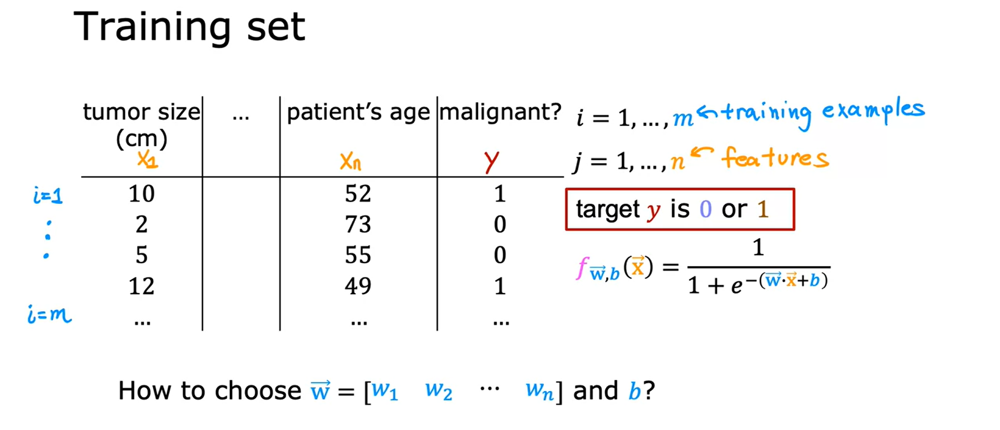
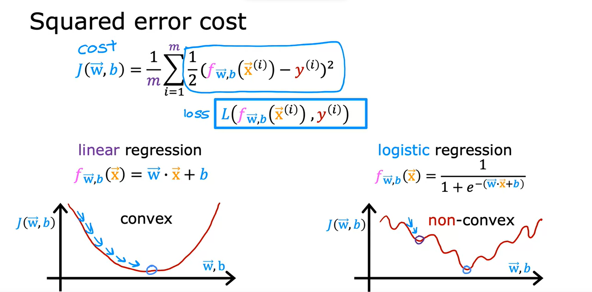
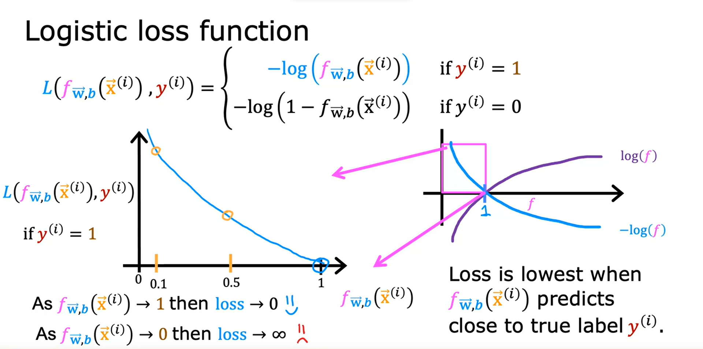
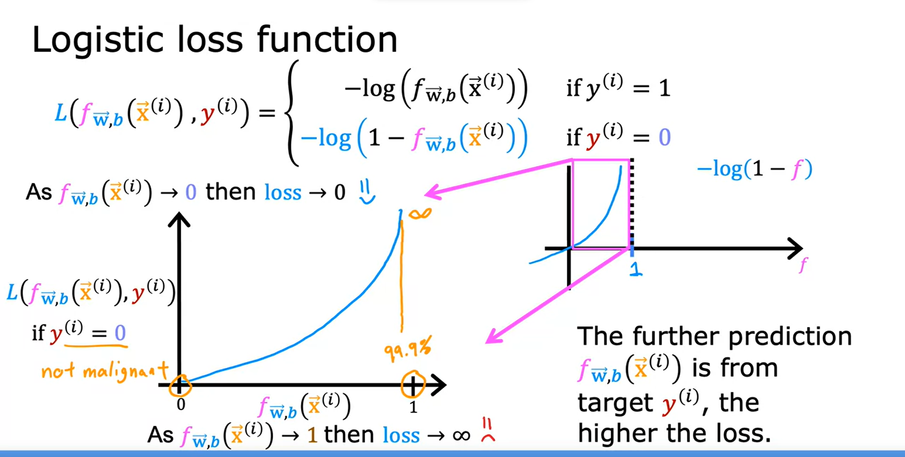
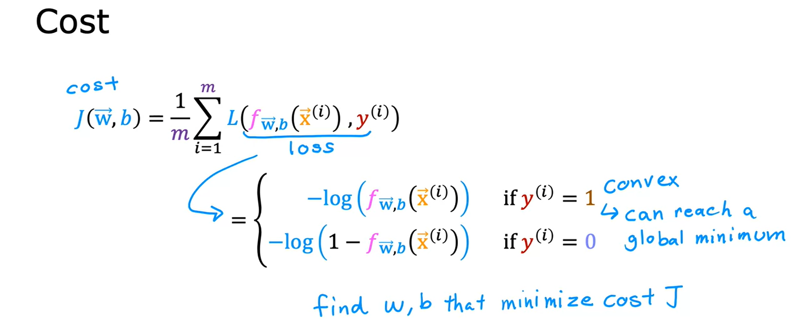
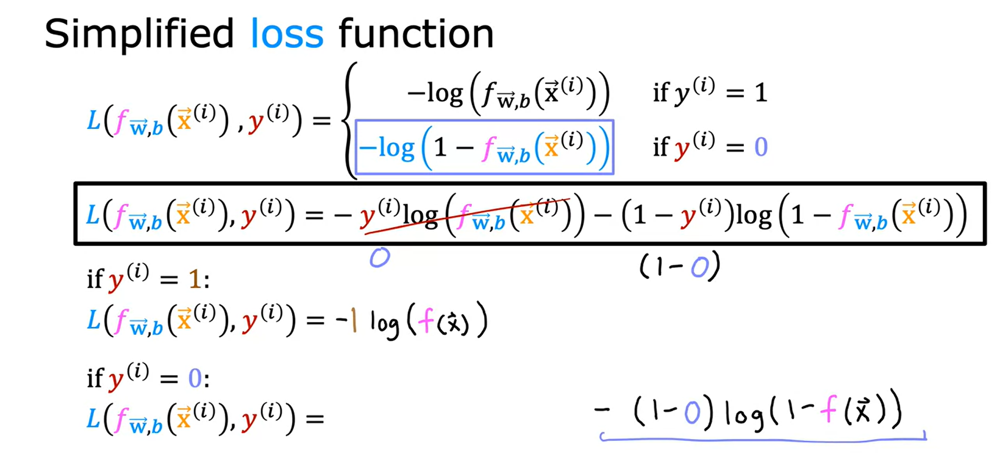
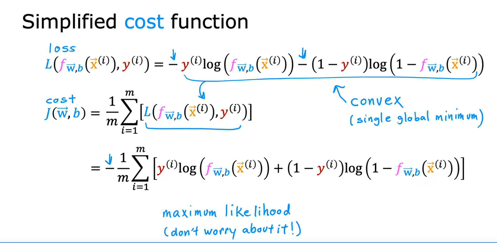
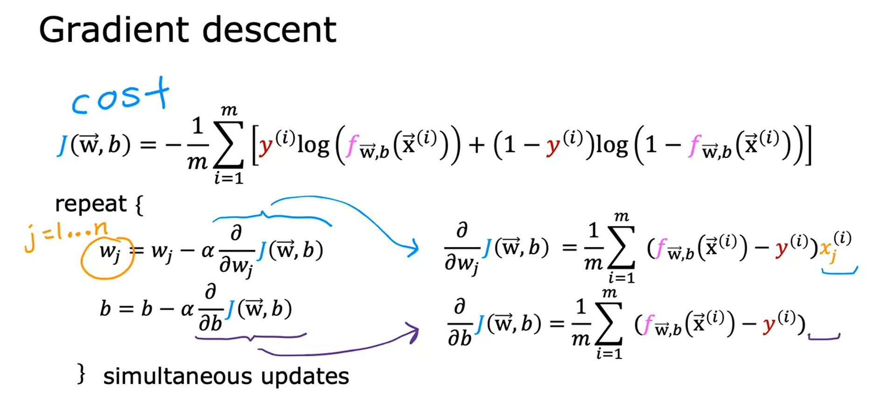
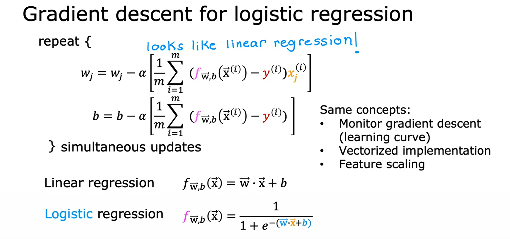

## Cost function and Gradient Descent for logistic regression

### Cost function for logistic regression

- The cost function gives you a way to measure how well a specific set of parameters fit the the training data
- It gives a way to choose better parameters
- Squared error cost function is not ideal for logistic regression
- Give training set, how can we choose parameters _w_ and _b_?

- For linear regression, we used the _squared cost function_
- With logistic regression, there are lots of local minimums if we use the squared error cost function

- _Loss function_ measures how well you are doing on one training example
- By summing up the _loss_ on all of the training examples

 

- Below is an example of what happens to Loss as f(x) -> 1 and f(x) -> 0 when y^(i) = 1
  - As f(x) -> 1, loss approaches 0
  - The tumor is malignant, so as our prediction gets closer to 1, loss gets closer to 0 (0 means no loss)
  - If the tumor is malignant, as our prediction gets closer to 0, loss gets closer to 1 (1 meaning completely wrong)

- Next is an example when y^(i) = 0

- Cost function for logistic regression formula

### Simplified Cost Function for Logistic Regression

- There is a simplified loss function and cost function that exists for binary classification problems where `y` can only be 0 or 1, cannot take on any value other than 0 or 1
- This is the simplified loss function and cost function, a the logic to get to that

1. Simplified loss function

2. Simplified cost function using the simplified loss function

### Gradient Descent for logistic regression

- How to fit the parameters of a logistic regression model?
- Apply gradient descent
    - Find the values of the parameters `w` and `b` that minimize the cost function J(w,b) 
- Below is general gradient descent approach

- This looks just like linear regression, is linear regression actually secretly the same as logistic regression?
- Well, remember the definition of f(x) itself is a different function or has changed

- Just like with linear regression: 
  - Want to monitor gradient descent (learning curve)
  - You can just apply the same method for logistic regression to make sure it also converges
  - Use a vectorized implementation to improve speed
  - Use feature scaling to to take on similar ranges of values, make it converge faster