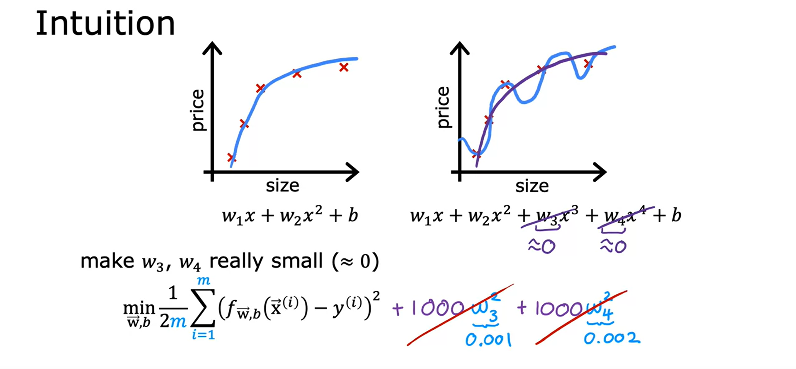

## The Problem of Overfitting

### The Concepts of Overfitting and Underfitting

- Sometimes our learning algorithm can run into *overfitting* 
- Underfitting means algorithm does not fit the training data very well - it has *high bias*
- There's a clear pattern in the training data that the algorithm is just unable to capture
- *Generalization* means that the algorithm does fit the training set well and would predict a new unseen value fairly accurately
- Overfit means the algorithm has fit the training set too well - it has *high variance*
  - You can even have a 0 cost function because we're fitting the data perfectly
  - If the training sets were just a little bit differently, the the function that the algorithm fits could be totally different and therefore the algorithm could make totally different predictions
  - This is what we mean when we say *high variance*

> **Overfitting** happens when a model fits the training data too well but performs poorly on new data
> **Underfitting** happens when a model is too simple and fails to capture the patterns in the training data

- To recap, if you have too many features like the fourth-order polynomial on the right, then the model may fit the training set well, but almost too well or overfit and have high variance
- On the flip side if you have too few features, then in this example, like the one on the left, it underfits and has high bias
- In this example, using quadratic features x and x squared, that seems to be just right
- We want to find a model that generalizes well - shouldn't overfit or underfit
- These same problems exist for classification problem as well

- The first one doesn't look terrible. It looks okay, but it doesn't look like a very good fit to the data either. This is an example of underfitting or of high bias.
- The second, the decision boundary look more like an ellipse or part of an ellipse. 
    - This is a pretty good fit to the data, even though it does not perfectly classify every single training example in the training set
    - Notice how some of these crosses get classified among the circles
    - But this model looks pretty good. It can call to just right
    - It looks like this generalized pretty well to new patients
- Last, with very high-order polynomial with many features like these, then the model may try really hard to find a decision boundary that fits your training data perfectly
    - Having all these higher-order polynomial features allows the algorithm to choose this really over the complex decision boundary
    - If the features are tumor size in age, and you're trying to classify tumors as malignant or benign, then this doesn't really look like a very good model for making predictions
    - This is an instance of overfitting and high variance because its model, despite doing very well on the training set, doesn't look like it'll generalize well to new examples

### Addressing Overfitting

- Collecting more training examples 
  - Can make your overfitting algorithm end up working pretty well

- Select features to include/exclude to reduce overfitting - *feature selection*
  - Having a lot of features without many training examples can lead to overfitting
  - Use your intuition to choose what you think is the best set of features, what's most relevant to the lead predicting the correct output
  - Disadvantage, by only using some features, we're throwing away some information that may be useful
    - There are tools that will automatically choose the most useful features to use (next course)

- Regularization is a way to keep all features and prevents features from having an overly large effect on the algorithm (which usually is what causes overfitting)
  - Will reduce the size of parameter
  - Usually w values are regularized and b isn't
  - This is commonly used with neural networks

### Cost Function with Regularization

- Basically what we are doing with the below since we have 1000 multipled to w3^2 and w4^2, we need to have very small values for w3 and w4 so that we minimize the cost
  - We *regularized* w3 and w4

- If you have a lot of features, you may not know which are the most important ones and which to penalize
- So you penalize all the features (all the wj) parameters which leads to the model being less prone to overfitting
- Lambda is the *regularization parameter*

- In this modified cost function, we want to minimize the original cost and the regularization term
  - Minimizing cost is for fitting the data
  - Regularization term is to keep wj small to reduce overfitting
  - Labmda is used to balance between these 2 goals
- If labmda is 0, model will overfit
- If labmda huge, model will underfit

For a model that includes the regularization parameter λ (lambda), increasing λ will tend to…

- **Decrease the size of parameters w1, w2, ..., wn**
- Decrease the size of the parameter b
- Increase the size of parameter 
- Increase the size of parameters w1, w2, ..., wn

Correct
Increasing the regularization parameter lambda reduces overfitting by reducing the size of the parameters. For some parameters that are near zero, this reduces the effect of the associated features.

### Regularized Linear Regression

- This is the linear regression and the new formulas with regularization

- Implementing gradient descent
- This is what you would have your code do
  - The update for w_j, for j equals 1 through and the update for b
  - Carry out simultaneous updates for all of these parameters

- Below is meant to give a deeper intuition of what regularization is doing
- On every single iteration, multiple *w* by a number slightly less than *1* which shrinks the value of wj by a little bit
- Assuming α, the learning rate, is a small number like 0.001, λ is 1, and m = 50, what is the effect of the 'new part' on updating wj?
  - **The new part decreases the value of wj each iteration by a little bit.**
  - The new part increases the value of wj each iteration by a little bit.
  - The new parts impact varies each iteration.

Correct: The new term decreases wj each iteration.

### Regularized Logistic Regression

- How to implement regularized logistic regression?
- We saw earlier that logistic regression can be prone to overfitting if you fit it with very high order polynomial features
- Then gets passed into the sigmoid function to compute f
- And end up with a decision boundary that is overly complex and overfits as training set

 

- When you minimize the cost function as a function of w and b, it has the effect of penalizing parameters w_1, w_2 through w_n, and preventing them from being too large
- If you do this, even with high order polynomial with a lot of parameters, you still get a decision boundary that looks more reasonable for separating positive and negative examples while also generalizing hopefully to new examples not in the training set.

- How to minimize this cost function j of wb that includes the regularization term?

For regularized **logistic** regression, how do the gradient descent update steps compare to the steps for linear regression?
  - **They look very similar, but the f(x) is not the same**
  - They are identical

Correct: For logistic regression, f(x) is the sigmoid (logistic) function, whereas for linear regression, f(x) is a linear function.