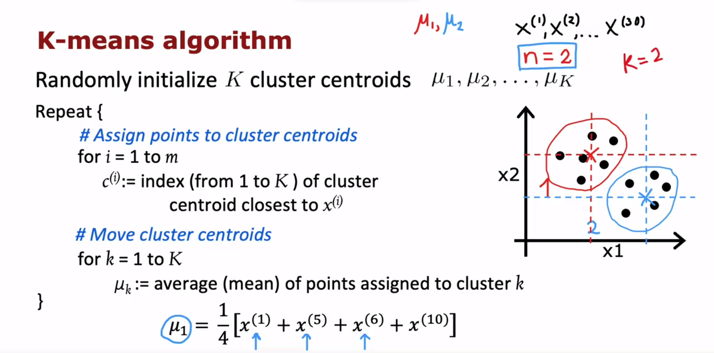
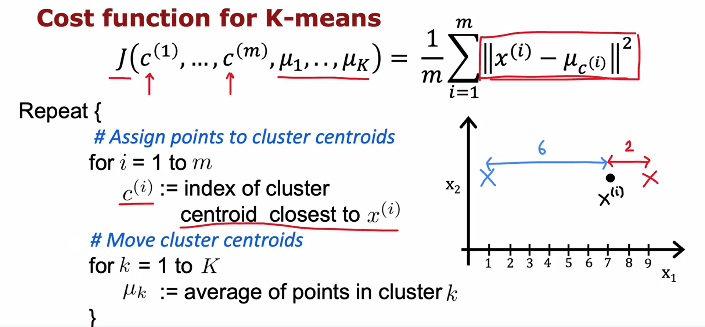
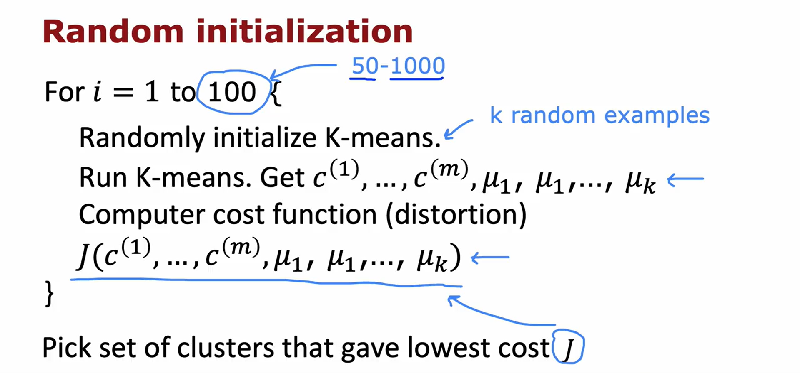

## Clustering

- Clustering is an unsupervised learning algorithm that finds data points that are related or similar to each other.
- In supervised learning, we have both input features (x) and target outputs (y), but in unsupervised learning, we only have input features (x) without target labels (y).
- Clustering algorithms aim to find interesting structures in the data by grouping similar data points into clusters.
- Some applications of clustering include grouping news articles, market segmentation, analyzing DNA data, and astronomical data analysis.
- The most commonly used clustering algorithm is the k-means algorithm, which will be discussed in the next video.

I hope this summary helps you understand the key points from the video! Let me know if you have any further questions.

### K-means intuition

**How k-means works?**

- Starts by randomly guessing the centers of the clusters.
- It then assigns each point to the cluster centroid that it is closest to.
  - cluster centroid refers to the center point of a cluster
- After assigning the points, it calculates the average location of the points in each cluster and moves the cluster centroid to that new location.
- This process of assigning points and moving centroids is repeated until there are no further changes in the assignments or centroid locations.
- The algorithm stop or converges when there are no more changes.
- The key steps of the K-means algorithm are
  - **assigning** points to cluster centroids based on proximity
  - **moving** the centroids to the average location of the points in each cluster.

### K-means algorithm

- In the first step, points are assigned to cluster centroids based on their distance.
- The distance between a point and a cluster centroid is computed using the L2 norm.
- The algorithm aims to minimize the squared distance between points and their assigned cluster centroids.
- In the second step, the cluster centroids are updated by computing the average of the points assigned to each cluster.
- If a cluster has zero points assigned to it, it is typically eliminated or randomly reinitialized.
- K-means can be applied to data sets with well-separated clusters or data sets with continuous variations.
- The algorithm tries to optimize a specific cost function.
- K-means is expected to converge and reach a stable solution.



```
1. Initialize K cluster centroids randomly: Mu1, Mu2, ..., MuK

2. Repeat until convergence:
   a. Assign each point to the closest cluster centroid:
      For i = 1 to m (number of training examples):
         Set ci = index of the cluster centroid closest to xi (using L2 norm)

   b. Move each cluster centroid to the mean of the points assigned to it:
      For k = 1 to K (number of clusters):
         Set Mk = mean of all points xi assigned to cluster k

3. Return the final cluster assignments and cluster centroids
```

Note: In the pseudocode, m represents the number of training examples, xi represents a training example, ci represents the cluster assignment variable for xi, and K represents the number of clusters. The mean of points assigned to a cluster is calculated by taking the average of the coordinates of those points.

### Optimization objective

- The K-means algorithm optimizes a specific cost function to find cluster assignments and centroid locations.
- The cost function, also known as the distortion function, measures the average squared distance between each training example and its assigned cluster centroid.
- The K-means algorithm has two steps: assigning points to cluster centroids and moving the centroids.
- In the assignment step, points are assigned to the closest centroid to minimize the squared distance.
- In the centroid movement step, the centroids are updated to the average location of the assigned points, minimizing the average squared distance.
- The algorithm iteratively updates the assignments and centroids to reduce the cost function.
- The cost function should always decrease or stay the same with each iteration, indicating convergence.
- Multiple random initializations of centroids can be used to find better clusters.
- The cost function can be used to determine if the algorithm has converged or if further iterations are necessary.



### Initializing K-means

- The first step of the K-means clustering algorithm is to choose random locations as initial guesses for the cluster centroids.
- The number of cluster centroids (K) should be less than or equal to the number of training examples (m).
- The most common way to choose the cluster centroids is to randomly pick K training examples.
- Running K-means with different random initializations can result in different sets of clusters.
- Sometimes, K-means may get stuck in a local minimum, resulting in suboptimal clustering.
- To find the best local optimum, you can run K-means multiple times with different random initializations.
- After running K-means multiple times, compute the cost function for each solution and choose the one with the lowest cost.
- Running K-means with multiple random initializations can often give better results than running it only once.
- It is recommended to try at least 50 to 100 random initializations for better clustering results.



### Choosing the number of clusters

- The k-means algorithm requires the number of clusters (k) as an input.
- Deciding the number of clusters can be ambiguous and subjective.
- The `elbow method` is one technique to choose the value of k.
  - It involves plotting the cost function (distortion function) as a function of the number of clusters.
  - The curve of the cost function can help gain insight into the optimal number of clusters.
  - However, the elbow method may not always have a clear elbow, making it less reliable.
- Minimizing the cost function is not a good technique for choosing k.
- Evaluating k-means based on its performance for a `downstream purpose` is recommended.
- An example of t-shirt sizing is given to illustrate this approach.
  - The trade-off between t-shirt fit and manufacturing costs can help decide the number of clusters.
- The programming exercise in the course also demonstrates the trade-off in image compression.
  - The quality of the compressed image and the size of the compressed image are considered.
  - The best value of k can be manually decided based on the desired image quality and size.

## Anomaly Detection

- Anomaly detection algorithms are used to detect unusual or anomalous events in an unlabeled dataset.
- The example given is using anomaly detection to check for possible problems with aircraft engines after they are manufactured.
- The algorithm learns from a dataset of normal events to determine if a new event is similar to the ones it has seen before.
- The algorithm uses density estimation to build a model for the probability of the features in the dataset.
- When a new event occurs, the algorithm computes the probability of that event and compares it to a threshold value.
- If the probability is below the threshold, the event is flagged as an anomaly.
- Anomaly detection is used in various applications such as fraud detection, manufacturing, and monitoring computer systems.
- Gaussian distribution is used to model the data in anomaly detection algorithms.

Beda

The role of Gaussian distribution in modeling the data in anomaly detection algorithms is as follows:

- Anomaly detection algorithms use Gaussian distribution (also known as the normal distribution) to model the data.
- Gaussian distribution is a probability distribution that is commonly used to represent the behavior of many variables in nature, including real-world data.
- In anomaly detection, the algorithm learns the parameters of the Gaussian distribution from the training data, such as the mean and standard deviation.
- The algorithm assumes that the normal events in the dataset follow a Gaussian distribution.
- By modeling the data using Gaussian distribution, the algorithm can estimate the probability of observing a particular event or data point.
- When a new event occurs, the algorithm computes the probability of that event based on the learned Gaussian distribution.
- If the probability of the event is below a certain threshold, it is considered an anomaly or unusual event.
- Gaussian distribution helps in distinguishing between normal and anomalous events by quantifying the likelihood of observing a particular event based on its deviation from the learned distribution.

In summary, Gaussian distribution is used in anomaly detection algorithms to model the data and determine the probability of observing an event, enabling the detection of anomalies based on deviations from the expected distribution.

### Gaussian (normal) distribution

Sure! Here's a summary of the video content in bullet points:

- The video introduces the Gaussian distribution, also known as the normal distribution, which is used in anomaly detection.
- The Gaussian distribution is a bell-shaped curve that represents the probability of a random variable taking on different values.
- The mean parameter (Mu) determines the center of the curve, while the variance parameter (Sigma squared) determines the width of the curve.
- Different values of Mu and Sigma can result in different shapes of the Gaussian distribution.
- To apply anomaly detection, we need to estimate the values of Mu and Sigma based on the training examples.
- The formulas for estimating Mu and Sigma are called maximum likelihood estimates.
- The estimated Gaussian distribution can be used to determine the probability of new examples being anomalous or not.
- In practical applications, anomaly detection often involves multiple features, and the Gaussian distribution can be extended to handle multiple features.

I hope this summary helps! Let me know if you have any further questions.

### Anomaly detection algorithm

- Anomaly detection involves estimating the probability of a given feature vector.
- The algorithm assumes that the features are statistically independent, but this is not necessary for the algorithm to work effectively.
- The algorithm models the probability of each feature using parameters such as mean and variance.
- The algorithm computes the probability of a new example using the product of the probabilities of its individual features.
- If the probability is below a certain threshold (epsilon), the example is flagged as an anomaly.
- The video provides an example of how the algorithm works on a dataset with two features.
- The algorithm decides whether an example is normal or an anomaly based on the probability calculation.
- The video concludes by mentioning that the next video will cover how to choose the parameter epsilon and evaluate the performance of an anomaly detection system.

I hope this summary helps! Let me know if you have any further questions.