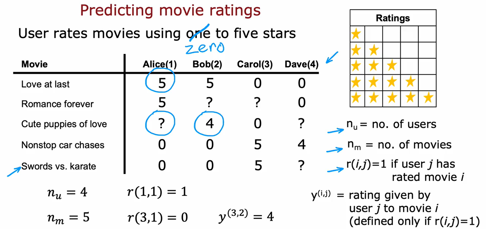

## Recomender System

### Making recommendations

- Recommender systems help companies drive sales and provide personalized recommendations to users.
- The example used in the video is predicting movie ratings on a movie streaming website.
- The system consists of users and items (movies in this case).
- Users rate movies on a scale of one to five stars.
- The video introduces the notation used: nu for the number of users and nm for the number of movies.
- The video explains the variables r(i,j) and y(i,j), which represent whether a user has rated a movie and the rating given by a user to a movie, respectively.
- The goal of a recommender system is to predict how users would rate movies they haven't watched.
- The video mentions the assumption of having access to features or extra information about the movies, such as genre.

### Using per-item features

How to develop a recommender system using features of each item, such as movies?
- Features are additional characteristics of the movies, like how much romance or action they contain.
- The notation
  -  nu for the number of users
  -  m for the number of movies
  -  n for the number of features
- Predictions for a user's movie ratings can be made using parameters w and b, similar to linear regression.
- Each user has their own set of parameters, denoted as w(j) and b(j), which are used to predict their ratings.
- The cost function for learning the parameters is similar to linear regression, with the addition of a regularization term to prevent overfitting.
- The goal is to minimize the cost function to obtain good parameters for predicting movie ratings.
- The video explains how to extend the algorithm to learn parameters for all users, not just one.
- By summing the cost function over all users, the algorithm can learn parameters for predicting movie ratings for all users.
- The algorithm is similar to linear regression, but with a different linear regression model for each user.
- The video concludes by mentioning that features are necessary for this algorithm, but the next video will discuss a modification that allows recommendations without detailed features.

### Collaborative filtering algorithm

- The video discusses how to learn features for movies in collaborative filtering.
- It explains that if you have parameters for users and ratings for movies, you can guess appropriate features for each movie.
- The video introduces a cost function for learning the features and explains how to minimize it using gradient descent.
- It shows how to update the parameters w, b, and x to find good values for them.
- The algorithm derived from this is called collaborative filtering, which uses ratings from multiple users to predict ratings for other users in the future.
- The video mentions that the problem formulation can also be used for binary labels.
- It concludes by mentioning that the next video will discuss a generalization of the model for binary labels.

### Binary labels: favs, likes and clicks

- The video discusses how to generalize the collaborative filtering algorithm to work with binary labels in recommender systems.
- Binary labels indicate whether a user liked or engaged with an item, instead of using star ratings.
- Examples of binary labels include whether a user made a purchase, clicked on an item, or spent a certain amount of time on it.
- To generalize the algorithm, the video introduces the logistic function, which predicts the probability of a user engaging with an item.
- The cost function is modified to the binary cross entropy cost function, which is commonly used in logistic regression.
- The video provides the formula for the cost function in collaborative filtering with binary labels.
- Implementing the algorithm with some modifications can improve its performance.

### Recommender systems implementation detail

- Mean normalization is a technique used in building recommender systems.
- It helps the algorithm make better predictions for new users who haven't rated any movies yet.
- Mean normalization involves subtracting the average rating for each movie from the original ratings.
- By doing this, the algorithm predicts more reasonable ratings for new users instead of assuming all ratings will be zero.
- Normalizing the mean of the movie ratings to be zero also helps the optimization algorithm run faster.
- There is an alternative approach of normalizing the columns of the matrix, but in this case, normalizing the rows is more important for new users.
- Mean normalization is an implementation detail that significantly improves the performance and accuracy of recommender systems.